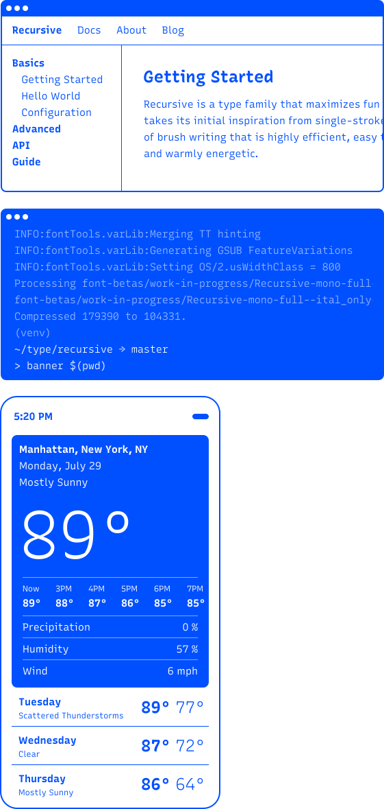

<!-- Responsive Version -->

## A highly-flexible new variable font.

Built to maximize versatility, control, and performance, Recursive is a five-axis variable font. This enables you to choose from a wide range of predefined styles, or dial in exactly what you want for each of its axes: *Proportion, Monospace, Weight, Slant, and Italic*. Taking full advantage of variable font technology, Recursive offers an unprecedented level of flexibility, all from a single font file.



## Extraordinarily versatile.

Recursive draws inspiration from single-stroke casual signpainting, a style of brush writing that is stylistically flexible and warmly energetic. Adapting this aesthetic basis into a type system, Recursive is designed to excel in digital interactive environments. This makes the typeface ideal for a wide range of uses, including data-rich apps, technical documentation and code editors.

<!--  -->

### One font. Infinite combinations.

Recursive is crafted with adaptability and diversity in mind, offering a complete type system but ensuring that each style can pair perfectly with its siblings. With so many possible variations across its subfamilies, weights and styles, Recursive allows for a dozen of font combinations that provide enough contrast to clearly define typographic roles, while maintaining a cohesive voice.

## Sans && Mono. In one file. `MONO`

The typeface comes in two practical and highly readable subfamilies, Sans and Mono. Thanks to its *Monospace* axis (`MONO`), both of these subfamilies can be used in a single font file. You can even select custom instances that are semi-proportional or semi-monospaced. 

Of course, vertical metrics such as line height, cap height, and x-height are shared across the entire *Monospace* axis. This allows harmonious and performant layouts, even where different proportions are mixed, such as in data-rich applications and technical documentation. 

*Recursive Sans* is made for text & user interface design. While its proportional characters deliver comfortable reading at text sizes, its heaviest weights are perfect to create punchy, tightly-spaced headlines.

*Recursive Mono* is made for code. Its characters share the same width for clear legibility and perfect alignment. This is particularly helpful for use in programming and data-heavy design tasks, but also allows for creative possibilities in display typography.

### A Sans for more robust layouts.

The characters within both subfamilies, Sans & Mono, maintain the exact same width across all font styles, independently of the values set on the *Weight, Casual, Slant, and Italic* axes. You can therefore use Recursive to create animated font transitions without breaking the layout of UI elements like menus and buttons.

        
<ul class="d-inline-block">
            <li id="item1Bad">Menu Item</li><li id="item2Bad">Item Two</li><li id="item3Bad">Choose Me</li>
        </ul>
font-family:  sans-serif;

            <svg width="60" height="64" viewBox="0 0 60 64" fill="none" xmlns="http://www.w3.org/2000/svg">
            <g filter="url(#filter0_d)">
            <path d="M27.7368 26.2464C27.7368 26.2464 27.1216 15.2334 25.2758 10.8959C23.3993 6.46607 21.2459 6.71217 19.4617 7.35818C16.7546 8.31182 17.1853 13.5722 17.9236 16.4947C18.9387 20.4015 19.5848 24.8928 21.369 32.8911C21.369 32.8911 18.9695 29.1073 16.7238 27.3846C14.4782 25.6619 10.3868 26.2464 9.43312 28.3383C8.47948 30.4301 9.21778 32.4604 10.5098 34.2754C11.8018 36.0904 13.6168 37.2594 15.1242 39.9357C16.6316 42.6121 17.216 44.6424 19.8309 46.7343C22.4149 48.8261 24.3837 49.9336 24.3837 51.5948V54.025L24.476 54.1173H46.2251C46.2251 46.7035 47.5479 45.6268 50.1628 42.1814C52.7776 38.736 52.8083 31.9682 52.8083 26.7078C52.8083 24.1853 52.07 22.5857 49.3014 22.5857C46.1944 22.5857 45.979 26.2464 45.979 26.2464C45.7637 22.8933 45.3023 19.5709 40.7186 19.5709C36.135 19.5709 36.781 26.0311 36.781 26.0311C36.781 23.1086 36.658 18.7711 31.6745 18.7711C26.6909 18.7711 27.7368 26.2464 27.7368 26.2464Z" fill="white" stroke="black" stroke-width="2" stroke-miterlimit="10" stroke-linecap="round" stroke-linejoin="round"></path>
            <path d="M30.69 34.3678V44.9194" stroke="black" stroke-width="2" stroke-miterlimit="10" stroke-linecap="round" stroke-linejoin="round"></path>
            <path d="M36.5964 34.3678V44.9194" stroke="black" stroke-width="2" stroke-miterlimit="10" stroke-linecap="round" stroke-linejoin="round"></path>
            <path d="M42.5337 34.3678V44.9194" stroke="black" stroke-width="2" stroke-miterlimit="10" stroke-linecap="round" stroke-linejoin="round"></path>
            </g>
            <defs>
            <filter id="filter0_d" x="-4" y="0" width="68" height="68" filterUnits="userSpaceOnUse" color-interpolation-filters="sRGB">
            <feFlood flood-opacity="0" result="BackgroundImageFix"></feFlood>
            <feColorMatrix in="SourceAlpha" type="matrix" values="0 0 0 0 0 0 0 0 0 0 0 0 0 0 0 0 0 0 127 0"></feColorMatrix>
            <feOffset dy="4"></feOffset>
            <feGaussianBlur stdDeviation="2"></feGaussianBlur>
            <feColorMatrix type="matrix" values="0 0 0 0 0 0 0 0 0 0 0 0 0 0 0 0 0 0 0.5 0"></feColorMatrix>
            <feBlend mode="normal" in2="BackgroundImageFix" result="effect1_dropShadow"></feBlend>
            <feBlend mode="normal" in="SourceGraphic" in2="effect1_dropShadow" result="shape"></feBlend>
            </filter>
            </defs>
            </svg>
        

    

        <ul class="d-inline-block" id="good"><li id="item1Good">Menu Item</li><li id="item2Good">Item Two</li><li id="item3Good">Choose Me</li>
        </ul>
font-family: Recursive;

        

            <svg width="60" height="64" viewBox="0 0 60 64" fill="none" xmlns="http://www.w3.org/2000/svg">
            <g filter="url(#filter0_d)">
            <path d="M27.7368 26.2464C27.7368 26.2464 27.1216 15.2334 25.2758 10.8959C23.3993 6.46607 21.2459 6.71217 19.4617 7.35818C16.7546 8.31182 17.1853 13.5722 17.9236 16.4947C18.9387 20.4015 19.5848 24.8928 21.369 32.8911C21.369 32.8911 18.9695 29.1073 16.7238 27.3846C14.4782 25.6619 10.3868 26.2464 9.43312 28.3383C8.47948 30.4301 9.21778 32.4604 10.5098 34.2754C11.8018 36.0904 13.6168 37.2594 15.1242 39.9357C16.6316 42.6121 17.216 44.6424 19.8309 46.7343C22.4149 48.8261 24.3837 49.9336 24.3837 51.5948V54.025L24.476 54.1173H46.2251C46.2251 46.7035 47.5479 45.6268 50.1628 42.1814C52.7776 38.736 52.8083 31.9682 52.8083 26.7078C52.8083 24.1853 52.07 22.5857 49.3014 22.5857C46.1944 22.5857 45.979 26.2464 45.979 26.2464C45.7637 22.8933 45.3023 19.5709 40.7186 19.5709C36.135 19.5709 36.781 26.0311 36.781 26.0311C36.781 23.1086 36.658 18.7711 31.6745 18.7711C26.6909 18.7711 27.7368 26.2464 27.7368 26.2464Z" fill="white" stroke="black" stroke-width="2" stroke-miterlimit="10" stroke-linecap="round" stroke-linejoin="round"></path>
            <path d="M30.69 34.3678V44.9194" stroke="black" stroke-width="2" stroke-miterlimit="10" stroke-linecap="round" stroke-linejoin="round"></path>
            <path d="M36.5964 34.3678V44.9194" stroke="black" stroke-width="2" stroke-miterlimit="10" stroke-linecap="round" stroke-linejoin="round"></path>
            <path d="M42.5337 34.3678V44.9194" stroke="black" stroke-width="2" stroke-miterlimit="10" stroke-linecap="round" stroke-linejoin="round"></path>
            </g>
            <defs>
            <filter id="filter0_d" x="-4" y="0" width="68" height="68" filterUnits="userSpaceOnUse" color-interpolation-filters="sRGB">
            <feFlood flood-opacity="0" result="BackgroundImageFix"></feFlood>
            <feColorMatrix in="SourceAlpha" type="matrix" values="0 0 0 0 0 0 0 0 0 0 0 0 0 0 0 0 0 0 127 0"></feColorMatrix>
            <feOffset dy="4"></feOffset>
            <feGaussianBlur stdDeviation="2"></feGaussianBlur>
            <feColorMatrix type="matrix" values="0 0 0 0 0 0 0 0 0 0 0 0 0 0 0 0 0 0 0.5 0"></feColorMatrix>
            <feBlend mode="normal" in2="BackgroundImageFix" result="effect1_dropShadow"></feBlend>
            <feBlend mode="normal" in="SourceGraphic" in2="effect1_dropShadow" result="shape"></feBlend>
            </filter>
            </defs>
            </svg>
        

    

## Ready for work. Ready for play. `CASL`

Recursive uses its *Casual* axis (`CASL`) to offer a range of personality, allowing you to get just the right tone for any context. Along this axis, letterforms adjust in stroke curvature, contrast, and terminals to go from a sturdy, rational *Linear* to a friendly, energetic *Casual*. All the styles along this axis are designed to maintain high legibility at medium and text sizes. In display sizes, it is most effective to use either end of the *Casual* axis. 

*Linear* (`CASL 0`) styles have subtly-flattened edges and simple, open forms. This optimizes readability and enables enhanced focus in dense information, such as long-form text and complex code.

*Casual* (`CASL 1`) echoes the soft & curvy brush strokes of casual signpainting, but simplifies these forms for a striking and inviting tone. This makes it ideal for web headlines, code snippets, and command line interfaces.

    

    <svg viewBox="0 0 135 128" fill="none" xmlns="http://www.w3.org/2000/svg">
<path fill-rule="evenodd" clip-rule="evenodd" d="M24 16C28.4183 16 32 12.4183 32 8C32 3.58172 28.4183 0 24 0C19.5817 0 16 3.58172 16 8C16 12.4183 19.5817 16 24 16Z" fill="#0050FF"/>
<path style="transform: scale(0.7) translate(7px);" d="M24.8079 15.905V16.835C24.8079 16.88 24.8229 16.925 24.8529 16.955C24.8829 16.985 24.9279 17 24.9729 17H31.6479V16.07C31.6479 15.965 31.5879 15.905 31.4829 15.905H29.1129V6.515C29.1129 6.41 29.0529 6.35 28.9479 6.35H27.7779C27.3879 6.71 26.8629 7.175 26.3979 7.58C25.9179 8 25.4529 8.405 24.9879 8.825V9.845C24.9879 9.965 25.0179 10.025 25.1079 10.025C25.2279 10.025 25.6479 9.665 26.3979 9.005C27.0429 8.405 27.3429 8.105 27.7329 7.52H27.9429V15.905H24.8079Z" fill="white"/>
<path fill-rule="evenodd" clip-rule="evenodd" d="M59 36C63.4183 36 67 32.4183 67 28C67 23.5817 63.4183 20 59 20C54.5817 20 51 23.5817 51 28C51 32.4183 54.5817 36 59 36Z" fill="#0050FF"/>
<path d="M58.992 24.8C58.022 24.8 57.312 25.11 56.932 25.47C56.872 25.53 56.852 25.56 56.852 25.64V26.3H57.002C57.562 25.77 58.162 25.55 58.922 25.55C59.602 25.55 59.982 25.66 60.182 25.88C60.342 26.05 60.432 26.27 60.432 26.56V26.66C60.432 27.26 60.252 27.54 58.872 28.44C57.302 29.46 56.672 30.13 56.672 31.41V31.89C56.672 31.96 56.712 32 56.782 32H61.352V31.38C61.352 31.31 61.312 31.27 61.242 31.27H58.812C58.192 31.27 57.852 31.31 57.532 31.39H57.432C57.472 30.41 57.822 30.02 59.332 29.02C60.802 28.07 61.202 27.65 61.202 26.67V26.46C61.202 25.45 60.492 24.8 58.992 24.8Z" fill="white"/>
<path fill-rule="evenodd" clip-rule="evenodd" d="M106 32C110.418 32 114 28.4183 114 24C114 19.5817 110.418 16 106 16C101.582 16 98 19.5817 98 24C98 28.4183 101.582 32 106 32Z" fill="#0050FF"/>
<path d="M105.882 20.8C104.942 20.8 104.212 21.08 103.882 21.36C103.842 21.39 103.832 21.41 103.832 21.47V22.13H103.972C104.582 21.72 105.052 21.55 105.862 21.55C106.892 21.55 107.422 22.01 107.422 22.65V22.76C107.422 23.54 106.682 24.08 104.672 24.08V24.69C104.672 24.76 104.712 24.8 104.782 24.8C106.562 24.8 107.512 25.22 107.512 26.11V26.25C107.512 27.03 106.852 27.45 105.822 27.45C104.942 27.45 104.442 27.29 103.852 26.84H103.702V27.53C103.702 27.6 103.722 27.63 103.782 27.68C104.092 27.96 104.842 28.2 105.832 28.2C107.432 28.2 108.312 27.4 108.312 26.34V26.09C108.312 25.4 107.882 24.75 106.632 24.5V24.35C107.772 24.08 108.212 23.47 108.212 22.71V22.49C108.212 21.57 107.432 20.8 105.882 20.8Z" fill="white"/>
<path fill-rule="evenodd" clip-rule="evenodd" d="M13 60C17.4183 60 21 56.4183 21 52C21 47.5817 17.4183 44 13 44C8.58172 44 5 47.5817 5 52C5 56.4183 8.58172 60 13 60Z" fill="#0050FF"/>
<path d="M14.102 52.05C14.092 52.47 14.042 53.21 14.012 53.75H13.352C12.532 53.75 11.942 53.77 11.322 53.87V53.73C12.262 52.22 13.212 50.69 14.182 49.14V49H13.502C13.442 49 13.362 49.01 13.312 49.09C12.182 50.96 10.512 53.73 10.512 53.75V54.34C10.512 54.41 10.552 54.45 10.622 54.45H14.012V55.89C14.012 55.96 14.052 56 14.122 56H14.782V54.45H15.602V53.86C15.602 53.79 15.562 53.75 15.492 53.75H14.782V52.16C14.782 52.09 14.742 52.05 14.672 52.05H14.102Z" fill="white"/>
<path fill-rule="evenodd" clip-rule="evenodd" d="M8 97C12.4183 97 16 93.4183 16 89C16 84.5817 12.4183 81 8 81C3.58172 81 0 84.5817 0 89C0 93.4183 3.58172 97 8 97Z" fill="#0050FF"/>
<path d="M6.24195 86C6.11195 87.19 5.91195 89.11 5.84195 89.68C5.83195 89.78 5.87195 89.82 5.94195 89.82H6.58195C7.05195 89.63 7.56195 89.52 8.10195 89.52C9.13195 89.52 9.54195 89.99 9.54195 90.81V91.06C9.54195 91.92 8.96195 92.45 7.89195 92.45C7.03195 92.45 6.49195 92.28 5.90195 91.84H5.76195V92.55C5.76195 92.6 5.76195 92.62 5.80195 92.65C6.15195 92.97 6.93195 93.2 7.89195 93.2C9.43195 93.2 10.312 92.34 10.312 91.14V90.68C10.312 89.51 9.61195 88.85 8.28195 88.85C7.67195 88.85 7.21195 88.95 6.80195 89.17H6.64195C6.72195 88.44 6.83195 87.48 6.90195 86.82C6.91195 86.78 6.91195 86.73 6.92195 86.69H10.052V86.11C10.052 86.04 10.012 86 9.94195 86H6.24195Z" fill="white"/>
<path fill-rule="evenodd" clip-rule="evenodd" d="M59 75C63.4183 75 67 71.4183 67 67C67 62.5817 63.4183 59 59 59C54.5817 59 51 62.5817 51 67C51 71.4183 54.5817 75 59 75Z" fill="#0050FF"/>
<path d="M59.382 63.8C57.852 63.8 56.682 64.72 56.682 66.81V68.28C56.682 70.27 57.442 71.2 59.062 71.2C60.432 71.2 61.352 70.35 61.352 69.15V68.54C61.352 67.38 60.532 66.72 59.232 66.72C58.532 66.72 58.022 66.92 57.612 67.29H57.472V66.72C57.472 65.94 57.632 65.35 58.002 64.99C58.312 64.68 58.712 64.52 59.302 64.52C59.942 64.52 60.402 64.67 60.922 65.03H61.062V64.39C61.062 64.31 61.052 64.28 60.992 64.24C60.722 64.01 60.132 63.8 59.382 63.8ZM57.952 70.16C57.622 69.82 57.472 69.24 57.472 68.3V67.99C57.962 67.6 58.472 67.43 59.082 67.43C59.672 67.43 60.062 67.57 60.302 67.82C60.492 68.01 60.592 68.29 60.592 68.77V69.02C60.592 70.03 60.012 70.52 59.022 70.52C58.552 70.52 58.202 70.41 57.952 70.16Z" fill="white"/>
<path fill-rule="evenodd" clip-rule="evenodd" d="M127 128C131.418 128 135 124.418 135 120C135 115.582 131.418 112 127 112C122.582 112 119 115.582 119 120C119 124.418 122.582 128 127 128Z" fill="#0050FF"/>
<path d="M126.912 124C127.422 122.74 127.862 121.65 128.252 120.69C128.912 119.05 129.432 117.75 129.432 117.69V117.11C129.432 117.04 129.392 117 129.322 117H124.722V118.97C124.722 119.04 124.762 119.08 124.832 119.08H125.492V117.73H127.122C127.572 117.73 128.072 117.72 128.652 117.69V117.9C128.182 118.81 127.842 119.59 127.532 120.36C126.412 123.12 126.132 123.8 126.132 123.9C126.132 123.97 126.172 124.01 126.242 124.01C126.352 124 126.802 124 126.912 124Z" fill="white"/>
</svg>
    

    
CASL: 600

    

        &
        

            <b>Linear</b>
             1. Rationalized construction
             2. Smooth counters
             3. 20-unit terminal cuts
             4. 20-unit inktraps
             5. Flattened sides
             6. Simple diagonals
             7. Squared strokes
        

        

            <b>Casual</b>
             1. Brush-based construction
             2. Kinked counters
             3. 6-unit inktraps & terminals
             4. 6-unit inktraps & terminals
             5. Organic curves
             6. Curved diagonals
             7. Softened strokes
        

    

## Light to ExtraBlack. And everything in between. `wght`

Recursive comes in a wide range of weights, from Light (`300`) to a super-heavy Black (`900`). You can choose from its seven predefined weights, or set a custom value through its *Weight* (`wght`) axis. And because Recursive maintains consistent letterforms along the entire *Weight* axis, it allows for smooth animations between any of its different weights.

    
wght: 600

    

        
CASL: 0

        
1.00

    

    

        $$$$$
    

## Slant and Italics. Two axes that work great together, or separate. `slnt` & `ital`

In Recursive, italics and slant can be controlled separately. The *Italic* axis (`ital`) lets you switch on true italics, while the *Slant* axis (`slnt`) defines the angle of the letters. This makes it possible to use sloped romans ( `slnt -15, ital 0`), upright italics ( `slnt 0, ital 1`), or set custom values on both axes for more options to play with.  

Recursive’s true italics (`ital 1`) replace familiar letterforms with single-story cursive alternates. By default, Recursive will automatically apply these cursive alternates when setting the *Slant* axis (`slnt`) to a high value. This ensures that your code and text reads beautifully and instantly, no matter how slanted it needs to be.

    
slnt: 600

    
ital: 0 (off)ital: 0.5 (auto)ital: 1 (on)

    
&#x200a;g&#x200a;&#x200a;g&#x200a;&#x200a;g&#x200a;

## Powerful, yet simple to use.

As a variable font, Recursive gives you fine-grained control over each one of its styles. However, it also comes with 64 predefined styles that are easy to access through your font menu. Called *named instances¹*, these work just like regular static fonts do.

¹ Named instance: a predetermined location in the designspace of a variable font, similar to the "static instances" that are familiar in traditional digital fonts.

    

        

            

                Recursive
            

            

                
Light (300)

                
Regular (400)

                
Medium (500)

                
Semibold (600)

                
Bold (700)

                
ExtraBold (800)

                
Heavy (900)

                
ExtraBlack (1000)

            

        

        

            

                

                    
Mono

                    

                        

                            
Casual

                            

                                <ul class="mono casual normal float-left">
                                    <li class="header">Normal</li>
                                    <li class="rw">rw</li>
                                    <li class="rw">rw</li>
                                    <li class="rw">rw</li>
                                    <li class="rw">rw</li>
                                    <li class="rw">rw</li>
                                    <li class="rw">rw</li>
                                    <li class="rw">rw</li>
                                    <li class="rw">rw</li>
                                </ul>
                                <ul class="mono casual italic float-left">
                                    <li class="header">Italic</li>
                                    <li class="rw">rw</li>
                                    <li class="rw">rw</li>
                                    <li class="rw">rw</li>
                                    <li class="rw">rw</li>
                                    <li class="rw">rw</li>
                                    <li class="rw">rw</li>
                                    <li class="rw">rw</li>
                                    <li class="rw">rw</li>
                                </ul>
                            

                        

                        

                            
Linear

                            

                                <ul class="mono linear normal float-left">
                                    <li class="header">Normal</li>
                                    <li class="rw">rw</li>
                                    <li class="rw">rw</li>
                                    <li class="rw">rw</li>
                                    <li class="rw">rw</li>
                                    <li class="rw">rw</li>
                                    <li class="rw">rw</li>
                                    <li class="rw">rw</li>
                                    <li class="rw">rw</li>
                                </ul>
                                <ul class="mono linear italic float-left">
                                    <li class="header">Italic</li>
                                    <li class="rw">rw</li>
                                    <li class="rw">rw</li>
                                    <li class="rw">rw</li>
                                    <li class="rw">rw</li>
                                    <li class="rw">rw</li>
                                    <li class="rw">rw</li>
                                    <li class="rw">rw</li>
                                    <li class="rw">rw</li>
                                </ul>
                            

                        

                    

                

                

                
Sans

                

                    

                        
Casual

                        

                            <ul class="sans casual normal float-left">
                                <li class="header">Normal</li>
                                <li class="rw">rw</li>
                                <li class="rw">rw</li>
                                <li class="rw">rw</li>
                                <li class="rw">rw</li>
                                <li class="rw">rw</li>
                                <li class="rw">rw</li>
                                <li class="rw">rw</li>
                                <li class="rw">rw</li>
                            </ul>
                            <ul class="sans casual italic float-left">
                                <li class="header">Italic</li>
                                <li class="rw">rw</li>
                                <li class="rw">rw</li>
                                <li class="rw">rw</li>
                                <li class="rw">rw</li>
                                <li class="rw">rw</li>
                                <li class="rw">rw</li>
                                <li class="rw">rw</li>
                                <li class="rw">rw</li>
                            </ul>
                        

                    

                    

                        
Linear

                        

                            <ul class="sans linear normal float-left">
                                <li class="header">Normal</li>
                                <li class="rw">rw</li>
                                <li class="rw">rw</li>
                                <li class="rw">rw</li>
                                <li class="rw">rw</li>
                                <li class="rw">rw</li>
                                <li class="rw">rw</li>
                                <li class="rw">rw</li>
                                <li class="rw">rw</li>
                            </ul>
                            <ul class="sans linear italic float-left">
                                <li class="header">Italic</li>
                                <li class="rw">rw</li>
                                <li class="rw">rw</li>
                                <li class="rw">rw</li>
                                <li class="rw">rw</li>
                                <li class="rw">rw</li>
                                <li class="rw">rw</li>
                                <li class="rw">rw</li>
                                <li class="rw">rw</li>
                            </ul>
                        

                    

                

            

            
   
        

    

## Supports over 200 languages.

To meet the needs of global communication, Recursive supports a wide range of Latin-based languages, including Vietnamese. It also comes with an extended set of currencies, symbols, fractions, and arrows.

    

        
        Abenaki, Afaan Oromo, Afar, Afrikaans, Albanian, Alsatian, Amis, Anuta, Aragonese, Aranese, Aromanian, Arrernte, Arvanitic (Latin), Asturian, Atayal, Aymara, Azerbaijani, Bashkir (Latin), Basque, Belarusian (Latin), Bemba, Bikol, Bislama, Bosnian, Breton, Cape Verdean Creole, Catalan, Cebuano, Chamorro, Chavacano, Chichewa, Chickasaw, Cimbrian, Cofán, Cornish, Corsican, Creek, Crimean Tatar (Latin), Croatian, Czech, Danish, Dawan, Delaware, Dholuo, Drehu, Dutch, English, Esperanto, Estonian, Faroese, Fijian, Filipino, Finnish, Folkspraak, French, Frisian, Friulian, Gagauz (Latin), Galician, Ganda, Genoese, German, Gikuyu, Gooniyandi, Greenlandic (Kalaallisut), Guadeloupean Creole, Gwich’in, Haitian Creole, Hän, Hawaiian, Hiligaynon, Hopi, Hotcąk (Latin), Hungarian, Icelandic, Ido, Igbo, Ilocano, Indonesian, Interglossa, Interlingua, Irish, Istro-Romanian, Italian, Jamaican, Javanese (Latin), Jèrriais, Kaingang, Kala Lagaw Ya, Kapampangan (Latin), Kaqchikel, Karakalpak (Latin), Karelian (Latin), Kashubian, Kikongo, Kinyarwanda, Kiribati, Kirundi, Klingon, Kurdish (Latin), Ladin, Latin, Latino sine Flexione, Latvian, Lithuanian, Lojban, Lombard, Low Saxon, Luxembourgish, Maasai, Makhuwa, Malay, Maltese, Manx, Māori, Marquesan, Megleno-Romanian, Meriam Mir, Mirandese, Mohawk, Moldovan, Montagnais, Montenegrin, Murrinh-Patha, Nagamese Creole, Nahuatl, Ndebele, Neapolitan, Ngiyambaa, Niuean, Noongar, Norwegian, Novial, Occidental, Occitan, Old Icelandic, Old Norse, Onĕipŏt, Oshiwambo, Ossetian (Latin), Palauan, Papiamento, Piedmontese, Polish, Portuguese, Potawatomi, Q’eqchi’, Quechua, Rarotongan, Romanian, Romansh, Rotokas, Sami (Inari Sami), Sami (Lule Sami), Sami (Northern Sami), Sami (Southern Sami), Samoan, Sango, Saramaccan, Sardinian, Scottish Gaelic, Serbian (Latin), Seri, Seychellois Creole, Shawnee, Shona, Sicilian, Silesian, Slovak, Slovenian, Slovio (Latin), Somali, Sorbian (Lower Sorbian), Sorbian (Upper Sorbian), Sotho (Northern), Sotho (Southern), Spanish, Sranan, Sundanese (Latin), Swahili, Swazi, Swedish, Tagalog, Tahitian, Tetum, Tok Pisin, Tokelauan, Tongan, Tshiluba, Tsonga, Tswana, Tumbuka, Turkish, Turkmen (Latin), Tuvaluan, Tzotzil, Uzbek (Latin), Venetian, Vepsian, Vietnamese, Volapük, Võro, Wallisian, Walloon, Waray-Waray, Warlpiri, Wayuu, Welsh, Wik-Mungkan, Wiradjuri, Wolof, Xavante, Xhosa, Yapese, Yindjibarndi, Zapotec, Zarma, Zazaki, Zulu, Zuni
        
    

    
    

        
            A
            

                

                    <svg width="23" height="23" viewBox="0 0 23 23" fill="none" xmlns="http://www.w3.org/2000/svg">
                        <path d="M23 0H0V23L23 0Z" fill="white"/>
                    </svg>
                    <small>latin capital letter a (u+0041)</small>
                

                

                    A          
                

            

        
            
            À
            

                

                    <svg width="23" height="23" viewBox="0 0 23 23" fill="none" xmlns="http://www.w3.org/2000/svg">
                        <path d="M23 0H0V23L23 0Z" fill="white"/>
                    </svg>
                    <small>latin capital letter a with grave (u+00c0)</small>
                

                

                    À          
                

            

        
            
            Á
            

                

                    <svg width="23" height="23" viewBox="0 0 23 23" fill="none" xmlns="http://www.w3.org/2000/svg">
                        <path d="M23 0H0V23L23 0Z" fill="white"/>
                    </svg>
                    <small>latin capital letter a with acute (u+00c1)</small>
                

                

                    Á          
                

            

        
            
            Â
            

                

                    <svg width="23" height="23" viewBox="0 0 23 23" fill="none" xmlns="http://www.w3.org/2000/svg">
                        <path d="M23 0H0V23L23 0Z" fill="white"/>
                    </svg>
                    <small>latin capital letter a with circumflex (u+00c2)</small>
                

                

                    Â          
                

            

        
            
            Ã
            

                

                    <svg width="23" height="23" viewBox="0 0 23 23" fill="none" xmlns="http://www.w3.org/2000/svg">
                        <path d="M23 0H0V23L23 0Z" fill="white"/>
                    </svg>
                    <small>latin capital letter a with tilde (u+00c3)</small>
                

                

                    Ã          
                

            

        
            
            Ä
            

                

                    <svg width="23" height="23" viewBox="0 0 23 23" fill="none" xmlns="http://www.w3.org/2000/svg">
                        <path d="M23 0H0V23L23 0Z" fill="white"/>
                    </svg>
                    <small>latin capital letter a with diaeresis (u+00c4)</small>
                

                

                    Ä          
                

            

        
            
            Å
            

                

                    <svg width="23" height="23" viewBox="0 0 23 23" fill="none" xmlns="http://www.w3.org/2000/svg">
                        <path d="M23 0H0V23L23 0Z" fill="white"/>
                    </svg>
                    <small>latin capital letter a with ring above (u+00c5)</small>
                

                

                    Å          
                

            

        
            
            Ā
            

                

                    <svg width="23" height="23" viewBox="0 0 23 23" fill="none" xmlns="http://www.w3.org/2000/svg">
                        <path d="M23 0H0V23L23 0Z" fill="white"/>
                    </svg>
                    <small>latin capital letter a with macron (u+0100)</small>
                

                

                    Ā          
                

            

        
            
            Ă
            

                

                    <svg width="23" height="23" viewBox="0 0 23 23" fill="none" xmlns="http://www.w3.org/2000/svg">
                        <path d="M23 0H0V23L23 0Z" fill="white"/>
                    </svg>
                    <small>latin capital letter a with breve (u+0102)</small>
                

                

                    Ă          
                

            

        
            
            Ą
            

                

                    <svg width="23" height="23" viewBox="0 0 23 23" fill="none" xmlns="http://www.w3.org/2000/svg">
                        <path d="M23 0H0V23L23 0Z" fill="white"/>
                    </svg>
                    <small>latin capital letter a with ogonek (u+0104)</small>
                

                

                    Ą          
                

            

        
            
            Ǻ
            

                

                    <svg width="23" height="23" viewBox="0 0 23 23" fill="none" xmlns="http://www.w3.org/2000/svg">
                        <path d="M23 0H0V23L23 0Z" fill="white"/>
                    </svg>
                    <small>latin capital letter a with ring above and acute (u+01fa)</small>
                

                

                    Ǻ          
                

            

        
            
            Ạ
            

                

                    <svg width="23" height="23" viewBox="0 0 23 23" fill="none" xmlns="http://www.w3.org/2000/svg">
                        <path d="M23 0H0V23L23 0Z" fill="white"/>
                    </svg>
                    <small>latin capital letter a with dot below (u+1ea0)</small>
                

                

                    Ạ          
                

            

        
            
            B
            

                

                    <svg width="23" height="23" viewBox="0 0 23 23" fill="none" xmlns="http://www.w3.org/2000/svg">
                        <path d="M23 0H0V23L23 0Z" fill="white"/>
                    </svg>
                    <small>latin capital letter b (u+0042)</small>
                

                

                    B          
                

            

        
            
            C
            

                

                    <svg width="23" height="23" viewBox="0 0 23 23" fill="none" xmlns="http://www.w3.org/2000/svg">
                        <path d="M23 0H0V23L23 0Z" fill="white"/>
                    </svg>
                    <small>latin capital letter c (u+0043)</small>
                

                

                    C          
                

            

        
            
            Ç
            

                

                    <svg width="23" height="23" viewBox="0 0 23 23" fill="none" xmlns="http://www.w3.org/2000/svg">
                        <path d="M23 0H0V23L23 0Z" fill="white"/>
                    </svg>
                    <small>latin capital letter c with cedilla (u+00c7)</small>
                

                

                    Ç          
                

            

        
            
            Ć
            

                

                    <svg width="23" height="23" viewBox="0 0 23 23" fill="none" xmlns="http://www.w3.org/2000/svg">
                        <path d="M23 0H0V23L23 0Z" fill="white"/>
                    </svg>
                    <small>latin capital letter c with acute (u+0106)</small>
                

                

                    Ć          
                

            

        
            
            Ĉ
            

                

                    <svg width="23" height="23" viewBox="0 0 23 23" fill="none" xmlns="http://www.w3.org/2000/svg">
                        <path d="M23 0H0V23L23 0Z" fill="white"/>
                    </svg>
                    <small>latin capital letter c with circumflex (u+0108)</small>
                

                

                    Ĉ          
                

            

        
            
            Ċ
            

                

                    <svg width="23" height="23" viewBox="0 0 23 23" fill="none" xmlns="http://www.w3.org/2000/svg">
                        <path d="M23 0H0V23L23 0Z" fill="white"/>
                    </svg>
                    <small>latin capital letter c with dot above (u+010a)</small>
                

                

                    Ċ          
                

            

        
            
            Č
            

                

                    <svg width="23" height="23" viewBox="0 0 23 23" fill="none" xmlns="http://www.w3.org/2000/svg">
                        <path d="M23 0H0V23L23 0Z" fill="white"/>
                    </svg>
                    <small>latin capital letter c with caron (u+010c)</small>
                

                

                    Č          
                

            

        
            
            D
            

                

                    <svg width="23" height="23" viewBox="0 0 23 23" fill="none" xmlns="http://www.w3.org/2000/svg">
                        <path d="M23 0H0V23L23 0Z" fill="white"/>
                    </svg>
                    <small>latin capital letter d (u+0044)</small>
                

                

                    D          
                

            

        
            
            Ď
            

                

                    <svg width="23" height="23" viewBox="0 0 23 23" fill="none" xmlns="http://www.w3.org/2000/svg">
                        <path d="M23 0H0V23L23 0Z" fill="white"/>
                    </svg>
                    <small>latin capital letter d with caron (u+010e)</small>
                

                

                    Ď          
                

            

        
            
            E
            

                

                    <svg width="23" height="23" viewBox="0 0 23 23" fill="none" xmlns="http://www.w3.org/2000/svg">
                        <path d="M23 0H0V23L23 0Z" fill="white"/>
                    </svg>
                    <small>latin capital letter e (u+0045)</small>
                

                

                    E          
                

            

        
            
            È
            

                

                    <svg width="23" height="23" viewBox="0 0 23 23" fill="none" xmlns="http://www.w3.org/2000/svg">
                        <path d="M23 0H0V23L23 0Z" fill="white"/>
                    </svg>
                    <small>latin capital letter e with grave (u+00c8)</small>
                

                

                    È          
                

            

        
            
            É
            

                

                    <svg width="23" height="23" viewBox="0 0 23 23" fill="none" xmlns="http://www.w3.org/2000/svg">
                        <path d="M23 0H0V23L23 0Z" fill="white"/>
                    </svg>
                    <small>latin capital letter e with acute (u+00c9)</small>
                

                

                    É          
                

            

        
            
            Ê
            

                

                    <svg width="23" height="23" viewBox="0 0 23 23" fill="none" xmlns="http://www.w3.org/2000/svg">
                        <path d="M23 0H0V23L23 0Z" fill="white"/>
                    </svg>
                    <small>latin capital letter e with circumflex (u+00ca)</small>
                

                

                    Ê          
                

            

        
            
            Ë
            

                

                    <svg width="23" height="23" viewBox="0 0 23 23" fill="none" xmlns="http://www.w3.org/2000/svg">
                        <path d="M23 0H0V23L23 0Z" fill="white"/>
                    </svg>
                    <small>latin capital letter e with diaeresis (u+00cb)</small>
                

                

                    Ë          
                

            

        
            
            Ē
            

                

                    <svg width="23" height="23" viewBox="0 0 23 23" fill="none" xmlns="http://www.w3.org/2000/svg">
                        <path d="M23 0H0V23L23 0Z" fill="white"/>
                    </svg>
                    <small>latin capital letter e with macron (u+0112)</small>
                

                

                    Ē          
                

            

        
            
            Ĕ
            

                

                    <svg width="23" height="23" viewBox="0 0 23 23" fill="none" xmlns="http://www.w3.org/2000/svg">
                        <path d="M23 0H0V23L23 0Z" fill="white"/>
                    </svg>
                    <small>latin capital letter e with breve (u+0114)</small>
                

                

                    Ĕ          
                

            

        
            
            Ė
            

                

                    <svg width="23" height="23" viewBox="0 0 23 23" fill="none" xmlns="http://www.w3.org/2000/svg">
                        <path d="M23 0H0V23L23 0Z" fill="white"/>
                    </svg>
                    <small>latin capital letter e with dot above (u+0116)</small>
                

                

                    Ė          
                

            

        
            
            Ę
            

                

                    <svg width="23" height="23" viewBox="0 0 23 23" fill="none" xmlns="http://www.w3.org/2000/svg">
                        <path d="M23 0H0V23L23 0Z" fill="white"/>
                    </svg>
                    <small>latin capital letter e with ogonek (u+0118)</small>
                

                

                    Ę          
                

            

        
            
            Ě
            

                

                    <svg width="23" height="23" viewBox="0 0 23 23" fill="none" xmlns="http://www.w3.org/2000/svg">
                        <path d="M23 0H0V23L23 0Z" fill="white"/>
                    </svg>
                    <small>latin capital letter e with caron (u+011a)</small>
                

                

                    Ě          
                

            

        
            
            Ẹ
            

                

                    <svg width="23" height="23" viewBox="0 0 23 23" fill="none" xmlns="http://www.w3.org/2000/svg">
                        <path d="M23 0H0V23L23 0Z" fill="white"/>
                    </svg>
                    <small>latin capital letter e with dot below (u+1eb8)</small>
                

                

                    Ẹ          
                

            

        
            
            Ẽ
            

                

                    <svg width="23" height="23" viewBox="0 0 23 23" fill="none" xmlns="http://www.w3.org/2000/svg">
                        <path d="M23 0H0V23L23 0Z" fill="white"/>
                    </svg>
                    <small>latin capital letter e with tilde (u+1ebc)</small>
                

                

                    Ẽ          
                

            

        
            
            F
            

                

                    <svg width="23" height="23" viewBox="0 0 23 23" fill="none" xmlns="http://www.w3.org/2000/svg">
                        <path d="M23 0H0V23L23 0Z" fill="white"/>
                    </svg>
                    <small>latin capital letter f (u+0046)</small>
                

                

                    F          
                

            

        
            
            G
            

                

                    <svg width="23" height="23" viewBox="0 0 23 23" fill="none" xmlns="http://www.w3.org/2000/svg">
                        <path d="M23 0H0V23L23 0Z" fill="white"/>
                    </svg>
                    <small>latin capital letter g (u+0047)</small>
                

                

                    G          
                

            

        
            
            Ĝ
            

                

                    <svg width="23" height="23" viewBox="0 0 23 23" fill="none" xmlns="http://www.w3.org/2000/svg">
                        <path d="M23 0H0V23L23 0Z" fill="white"/>
                    </svg>
                    <small>latin capital letter g with circumflex (u+011c)</small>
                

                

                    Ĝ          
                

            

        
            
            Ğ
            

                

                    <svg width="23" height="23" viewBox="0 0 23 23" fill="none" xmlns="http://www.w3.org/2000/svg">
                        <path d="M23 0H0V23L23 0Z" fill="white"/>
                    </svg>
                    <small>latin capital letter g with breve (u+011e)</small>
                

                

                    Ğ          
                

            

        
            
            Ġ
            

                

                    <svg width="23" height="23" viewBox="0 0 23 23" fill="none" xmlns="http://www.w3.org/2000/svg">
                        <path d="M23 0H0V23L23 0Z" fill="white"/>
                    </svg>
                    <small>latin capital letter g with dot above (u+0120)</small>
                

                

                    Ġ          
                

            

        
            
            Ģ
            

                

                    <svg width="23" height="23" viewBox="0 0 23 23" fill="none" xmlns="http://www.w3.org/2000/svg">
                        <path d="M23 0H0V23L23 0Z" fill="white"/>
                    </svg>
                    <small>latin capital letter g with cedilla (u+0122)</small>
                

                

                    Ģ          
                

            

        
            
            Ǧ
            

                

                    <svg width="23" height="23" viewBox="0 0 23 23" fill="none" xmlns="http://www.w3.org/2000/svg">
                        <path d="M23 0H0V23L23 0Z" fill="white"/>
                    </svg>
                    <small>latin capital letter g with caron (u+01e6)</small>
                

                

                    Ǧ          
                

            

        
            
            H
            

                

                    <svg width="23" height="23" viewBox="0 0 23 23" fill="none" xmlns="http://www.w3.org/2000/svg">
                        <path d="M23 0H0V23L23 0Z" fill="white"/>
                    </svg>
                    <small>latin capital letter h (u+0048)</small>
                

                

                    H          
                

            

        
            
            Ĥ
            

                

                    <svg width="23" height="23" viewBox="0 0 23 23" fill="none" xmlns="http://www.w3.org/2000/svg">
                        <path d="M23 0H0V23L23 0Z" fill="white"/>
                    </svg>
                    <small>latin capital letter h with circumflex (u+0124)</small>
                

                

                    Ĥ          
                

            

        
            
            I
            

                

                    <svg width="23" height="23" viewBox="0 0 23 23" fill="none" xmlns="http://www.w3.org/2000/svg">
                        <path d="M23 0H0V23L23 0Z" fill="white"/>
                    </svg>
                    <small>latin capital letter i (u+0049)</small>
                

                

                    I          
                

            

        
            
            Ì
            

                

                    <svg width="23" height="23" viewBox="0 0 23 23" fill="none" xmlns="http://www.w3.org/2000/svg">
                        <path d="M23 0H0V23L23 0Z" fill="white"/>
                    </svg>
                    <small>latin capital letter i with grave (u+00cc)</small>
                

                

                    Ì          
                

            

        
            
            Í
            

                

                    <svg width="23" height="23" viewBox="0 0 23 23" fill="none" xmlns="http://www.w3.org/2000/svg">
                        <path d="M23 0H0V23L23 0Z" fill="white"/>
                    </svg>
                    <small>latin capital letter i with acute (u+00cd)</small>
                

                

                    Í          
                

            

        
            
            Î
            

                

                    <svg width="23" height="23" viewBox="0 0 23 23" fill="none" xmlns="http://www.w3.org/2000/svg">
                        <path d="M23 0H0V23L23 0Z" fill="white"/>
                    </svg>
                    <small>latin capital letter i with circumflex (u+00ce)</small>
                

                

                    Î          
                

            

        
            
            Ï
            

                

                    <svg width="23" height="23" viewBox="0 0 23 23" fill="none" xmlns="http://www.w3.org/2000/svg">
                        <path d="M23 0H0V23L23 0Z" fill="white"/>
                    </svg>
                    <small>latin capital letter i with diaeresis (u+00cf)</small>
                

                

                    Ï          
                

            

        
            
            Ĩ
            

                

                    <svg width="23" height="23" viewBox="0 0 23 23" fill="none" xmlns="http://www.w3.org/2000/svg">
                        <path d="M23 0H0V23L23 0Z" fill="white"/>
                    </svg>
                    <small>latin capital letter i with tilde (u+0128)</small>
                

                

                    Ĩ          
                

            

        
            
            Ī
            

                

                    <svg width="23" height="23" viewBox="0 0 23 23" fill="none" xmlns="http://www.w3.org/2000/svg">
                        <path d="M23 0H0V23L23 0Z" fill="white"/>
                    </svg>
                    <small>latin capital letter i with macron (u+012a)</small>
                

                

                    Ī          
                

            

        
            
            Ĭ
            

                

                    <svg width="23" height="23" viewBox="0 0 23 23" fill="none" xmlns="http://www.w3.org/2000/svg">
                        <path d="M23 0H0V23L23 0Z" fill="white"/>
                    </svg>
                    <small>latin capital letter i with breve (u+012c)</small>
                

                

                    Ĭ          
                

            

        
            
            Į
            

                

                    <svg width="23" height="23" viewBox="0 0 23 23" fill="none" xmlns="http://www.w3.org/2000/svg">
                        <path d="M23 0H0V23L23 0Z" fill="white"/>
                    </svg>
                    <small>latin capital letter i with ogonek (u+012e)</small>
                

                

                    Į          
                

            

        
            
            İ
            

                

                    <svg width="23" height="23" viewBox="0 0 23 23" fill="none" xmlns="http://www.w3.org/2000/svg">
                        <path d="M23 0H0V23L23 0Z" fill="white"/>
                    </svg>
                    <small>latin capital letter i with dot above (u+0130)</small>
                

                

                    İ          
                

            

        
            
            Ị
            

                

                    <svg width="23" height="23" viewBox="0 0 23 23" fill="none" xmlns="http://www.w3.org/2000/svg">
                        <path d="M23 0H0V23L23 0Z" fill="white"/>
                    </svg>
                    <small>latin capital letter i with dot below (u+1eca)</small>
                

                

                    Ị          
                

            

        
            
            J
            

                

                    <svg width="23" height="23" viewBox="0 0 23 23" fill="none" xmlns="http://www.w3.org/2000/svg">
                        <path d="M23 0H0V23L23 0Z" fill="white"/>
                    </svg>
                    <small>latin capital letter j (u+004a)</small>
                

                

                    J          
                

            

        
            
            Ĵ
            

                

                    <svg width="23" height="23" viewBox="0 0 23 23" fill="none" xmlns="http://www.w3.org/2000/svg">
                        <path d="M23 0H0V23L23 0Z" fill="white"/>
                    </svg>
                    <small>latin capital letter j with circumflex (u+0134)</small>
                

                

                    Ĵ          
                

            

        
            
            K
            

                

                    <svg width="23" height="23" viewBox="0 0 23 23" fill="none" xmlns="http://www.w3.org/2000/svg">
                        <path d="M23 0H0V23L23 0Z" fill="white"/>
                    </svg>
                    <small>latin capital letter k (u+004b)</small>
                

                

                    K          
                

            

        
            
            Ķ
            

                

                    <svg width="23" height="23" viewBox="0 0 23 23" fill="none" xmlns="http://www.w3.org/2000/svg">
                        <path d="M23 0H0V23L23 0Z" fill="white"/>
                    </svg>
                    <small>latin capital letter k with cedilla (u+0136)</small>
                

                

                    Ķ          
                

            

        
            
            L
            

                

                    <svg width="23" height="23" viewBox="0 0 23 23" fill="none" xmlns="http://www.w3.org/2000/svg">
                        <path d="M23 0H0V23L23 0Z" fill="white"/>
                    </svg>
                    <small>latin capital letter l (u+004c)</small>
                

                

                    L          
                

            

        
            
            Ĺ
            

                

                    <svg width="23" height="23" viewBox="0 0 23 23" fill="none" xmlns="http://www.w3.org/2000/svg">
                        <path d="M23 0H0V23L23 0Z" fill="white"/>
                    </svg>
                    <small>latin capital letter l with acute (u+0139)</small>
                

                

                    Ĺ          
                

            

        
            
            Ļ
            

                

                    <svg width="23" height="23" viewBox="0 0 23 23" fill="none" xmlns="http://www.w3.org/2000/svg">
                        <path d="M23 0H0V23L23 0Z" fill="white"/>
                    </svg>
                    <small>latin capital letter l with cedilla (u+013b)</small>
                

                

                    Ļ          
                

            

        
            
            Ľ
            

                

                    <svg width="23" height="23" viewBox="0 0 23 23" fill="none" xmlns="http://www.w3.org/2000/svg">
                        <path d="M23 0H0V23L23 0Z" fill="white"/>
                    </svg>
                    <small>latin capital letter l with caron (u+013d)</small>
                

                

                    Ľ          
                

            

        
            
            M
            

                

                    <svg width="23" height="23" viewBox="0 0 23 23" fill="none" xmlns="http://www.w3.org/2000/svg">
                        <path d="M23 0H0V23L23 0Z" fill="white"/>
                    </svg>
                    <small>latin capital letter m (u+004d)</small>
                

                

                    M          
                

            

        
            
            N
            

                

                    <svg width="23" height="23" viewBox="0 0 23 23" fill="none" xmlns="http://www.w3.org/2000/svg">
                        <path d="M23 0H0V23L23 0Z" fill="white"/>
                    </svg>
                    <small>latin capital letter n (u+004e)</small>
                

                

                    N          
                

            

        
            
            Ñ
            

                

                    <svg width="23" height="23" viewBox="0 0 23 23" fill="none" xmlns="http://www.w3.org/2000/svg">
                        <path d="M23 0H0V23L23 0Z" fill="white"/>
                    </svg>
                    <small>latin capital letter n with tilde (u+00d1)</small>
                

                

                    Ñ          
                

            

        
            
            Ń
            

                

                    <svg width="23" height="23" viewBox="0 0 23 23" fill="none" xmlns="http://www.w3.org/2000/svg">
                        <path d="M23 0H0V23L23 0Z" fill="white"/>
                    </svg>
                    <small>latin capital letter n with acute (u+0143)</small>
                

                

                    Ń          
                

            

        
            
            Ņ
            

                

                    <svg width="23" height="23" viewBox="0 0 23 23" fill="none" xmlns="http://www.w3.org/2000/svg">
                        <path d="M23 0H0V23L23 0Z" fill="white"/>
                    </svg>
                    <small>latin capital letter n with cedilla (u+0145)</small>
                

                

                    Ņ          
                

            

        
            
            Ň
            

                

                    <svg width="23" height="23" viewBox="0 0 23 23" fill="none" xmlns="http://www.w3.org/2000/svg">
                        <path d="M23 0H0V23L23 0Z" fill="white"/>
                    </svg>
                    <small>latin capital letter n with caron (u+0147)</small>
                

                

                    Ň          
                

            

        
            
            O
            

                

                    <svg width="23" height="23" viewBox="0 0 23 23" fill="none" xmlns="http://www.w3.org/2000/svg">
                        <path d="M23 0H0V23L23 0Z" fill="white"/>
                    </svg>
                    <small>latin capital letter o (u+004f)</small>
                

                

                    O          
                

            

        
            
            Ò
            

                

                    <svg width="23" height="23" viewBox="0 0 23 23" fill="none" xmlns="http://www.w3.org/2000/svg">
                        <path d="M23 0H0V23L23 0Z" fill="white"/>
                    </svg>
                    <small>latin capital letter o with grave (u+00d2)</small>
                

                

                    Ò          
                

            

        
            
            Ó
            

                

                    <svg width="23" height="23" viewBox="0 0 23 23" fill="none" xmlns="http://www.w3.org/2000/svg">
                        <path d="M23 0H0V23L23 0Z" fill="white"/>
                    </svg>
                    <small>latin capital letter o with acute (u+00d3)</small>
                

                

                    Ó          
                

            

        
            
            Ô
            

                

                    <svg width="23" height="23" viewBox="0 0 23 23" fill="none" xmlns="http://www.w3.org/2000/svg">
                        <path d="M23 0H0V23L23 0Z" fill="white"/>
                    </svg>
                    <small>latin capital letter o with circumflex (u+00d4)</small>
                

                

                    Ô          
                

            

        
            
            Õ
            

                

                    <svg width="23" height="23" viewBox="0 0 23 23" fill="none" xmlns="http://www.w3.org/2000/svg">
                        <path d="M23 0H0V23L23 0Z" fill="white"/>
                    </svg>
                    <small>latin capital letter o with tilde (u+00d5)</small>
                

                

                    Õ          
                

            

        
            
            Ö
            

                

                    <svg width="23" height="23" viewBox="0 0 23 23" fill="none" xmlns="http://www.w3.org/2000/svg">
                        <path d="M23 0H0V23L23 0Z" fill="white"/>
                    </svg>
                    <small>latin capital letter o with diaeresis (u+00d6)</small>
                

                

                    Ö          
                

            

        
            
            Ō
            

                

                    <svg width="23" height="23" viewBox="0 0 23 23" fill="none" xmlns="http://www.w3.org/2000/svg">
                        <path d="M23 0H0V23L23 0Z" fill="white"/>
                    </svg>
                    <small>latin capital letter o with macron (u+014c)</small>
                

                

                    Ō          
                

            

        
            
            Ŏ
            

                

                    <svg width="23" height="23" viewBox="0 0 23 23" fill="none" xmlns="http://www.w3.org/2000/svg">
                        <path d="M23 0H0V23L23 0Z" fill="white"/>
                    </svg>
                    <small>latin capital letter o with breve (u+014e)</small>
                

                

                    Ŏ          
                

            

        
            
            Ő
            

                

                    <svg width="23" height="23" viewBox="0 0 23 23" fill="none" xmlns="http://www.w3.org/2000/svg">
                        <path d="M23 0H0V23L23 0Z" fill="white"/>
                    </svg>
                    <small>latin capital letter o with double acute (u+0150)</small>
                

                

                    Ő          
                

            

        
            
            Ǫ
            

                

                    <svg width="23" height="23" viewBox="0 0 23 23" fill="none" xmlns="http://www.w3.org/2000/svg">
                        <path d="M23 0H0V23L23 0Z" fill="white"/>
                    </svg>
                    <small>latin capital letter o with ogonek (u+01ea)</small>
                

                

                    Ǫ          
                

            

        
            
            Ọ
            

                

                    <svg width="23" height="23" viewBox="0 0 23 23" fill="none" xmlns="http://www.w3.org/2000/svg">
                        <path d="M23 0H0V23L23 0Z" fill="white"/>
                    </svg>
                    <small>latin capital letter o with dot below (u+1ecc)</small>
                

                

                    Ọ          
                

            

        
            
            P
            

                

                    <svg width="23" height="23" viewBox="0 0 23 23" fill="none" xmlns="http://www.w3.org/2000/svg">
                        <path d="M23 0H0V23L23 0Z" fill="white"/>
                    </svg>
                    <small>latin capital letter p (u+0050)</small>
                

                

                    P          
                

            

        
            
            Q
            

                

                    <svg width="23" height="23" viewBox="0 0 23 23" fill="none" xmlns="http://www.w3.org/2000/svg">
                        <path d="M23 0H0V23L23 0Z" fill="white"/>
                    </svg>
                    <small>latin capital letter q (u+0051)</small>
                

                

                    Q          
                

            

        
            
            R
            

                

                    <svg width="23" height="23" viewBox="0 0 23 23" fill="none" xmlns="http://www.w3.org/2000/svg">
                        <path d="M23 0H0V23L23 0Z" fill="white"/>
                    </svg>
                    <small>latin capital letter r (u+0052)</small>
                

                

                    R          
                

            

        
            
            Ŕ
            

                

                    <svg width="23" height="23" viewBox="0 0 23 23" fill="none" xmlns="http://www.w3.org/2000/svg">
                        <path d="M23 0H0V23L23 0Z" fill="white"/>
                    </svg>
                    <small>latin capital letter r with acute (u+0154)</small>
                

                

                    Ŕ          
                

            

        
            
            Ŗ
            

                

                    <svg width="23" height="23" viewBox="0 0 23 23" fill="none" xmlns="http://www.w3.org/2000/svg">
                        <path d="M23 0H0V23L23 0Z" fill="white"/>
                    </svg>
                    <small>latin capital letter r with cedilla (u+0156)</small>
                

                

                    Ŗ          
                

            

        
            
            Ř
            

                

                    <svg width="23" height="23" viewBox="0 0 23 23" fill="none" xmlns="http://www.w3.org/2000/svg">
                        <path d="M23 0H0V23L23 0Z" fill="white"/>
                    </svg>
                    <small>latin capital letter r with caron (u+0158)</small>
                

                

                    Ř          
                

            

        
            
            S
            

                

                    <svg width="23" height="23" viewBox="0 0 23 23" fill="none" xmlns="http://www.w3.org/2000/svg">
                        <path d="M23 0H0V23L23 0Z" fill="white"/>
                    </svg>
                    <small>latin capital letter s (u+0053)</small>
                

                

                    S          
                

            

        
            
            Ś
            

                

                    <svg width="23" height="23" viewBox="0 0 23 23" fill="none" xmlns="http://www.w3.org/2000/svg">
                        <path d="M23 0H0V23L23 0Z" fill="white"/>
                    </svg>
                    <small>latin capital letter s with acute (u+015a)</small>
                

                

                    Ś          
                

            

        
            
            Ŝ
            

                

                    <svg width="23" height="23" viewBox="0 0 23 23" fill="none" xmlns="http://www.w3.org/2000/svg">
                        <path d="M23 0H0V23L23 0Z" fill="white"/>
                    </svg>
                    <small>latin capital letter s with circumflex (u+015c)</small>
                

                

                    Ŝ          
                

            

        
            
            Ş
            

                

                    <svg width="23" height="23" viewBox="0 0 23 23" fill="none" xmlns="http://www.w3.org/2000/svg">
                        <path d="M23 0H0V23L23 0Z" fill="white"/>
                    </svg>
                    <small>latin capital letter s with cedilla (u+015e)</small>
                

                

                    Ş          
                

            

        
            
            Š
            

                

                    <svg width="23" height="23" viewBox="0 0 23 23" fill="none" xmlns="http://www.w3.org/2000/svg">
                        <path d="M23 0H0V23L23 0Z" fill="white"/>
                    </svg>
                    <small>latin capital letter s with caron (u+0160)</small>
                

                

                    Š          
                

            

        
            
            Ș
            

                

                    <svg width="23" height="23" viewBox="0 0 23 23" fill="none" xmlns="http://www.w3.org/2000/svg">
                        <path d="M23 0H0V23L23 0Z" fill="white"/>
                    </svg>
                    <small>latin capital letter s with comma below (u+0218)</small>
                

                

                    Ș          
                

            

        
            
            T
            

                

                    <svg width="23" height="23" viewBox="0 0 23 23" fill="none" xmlns="http://www.w3.org/2000/svg">
                        <path d="M23 0H0V23L23 0Z" fill="white"/>
                    </svg>
                    <small>latin capital letter t (u+0054)</small>
                

                

                    T          
                

            

        
            
            Ţ
            

                

                    <svg width="23" height="23" viewBox="0 0 23 23" fill="none" xmlns="http://www.w3.org/2000/svg">
                        <path d="M23 0H0V23L23 0Z" fill="white"/>
                    </svg>
                    <small>latin capital letter t with cedilla (u+0162)</small>
                

                

                    Ţ          
                

            

        
            
            Ť
            

                

                    <svg width="23" height="23" viewBox="0 0 23 23" fill="none" xmlns="http://www.w3.org/2000/svg">
                        <path d="M23 0H0V23L23 0Z" fill="white"/>
                    </svg>
                    <small>latin capital letter t with caron (u+0164)</small>
                

                

                    Ť          
                

            

        
            
            Ț
            

                

                    <svg width="23" height="23" viewBox="0 0 23 23" fill="none" xmlns="http://www.w3.org/2000/svg">
                        <path d="M23 0H0V23L23 0Z" fill="white"/>
                    </svg>
                    <small>latin capital letter t with comma below (u+021a)</small>
                

                

                    Ț          
                

            

        
            
            U
            

                

                    <svg width="23" height="23" viewBox="0 0 23 23" fill="none" xmlns="http://www.w3.org/2000/svg">
                        <path d="M23 0H0V23L23 0Z" fill="white"/>
                    </svg>
                    <small>latin capital letter u (u+0055)</small>
                

                

                    U          
                

            

        
            
            Ù
            

                

                    <svg width="23" height="23" viewBox="0 0 23 23" fill="none" xmlns="http://www.w3.org/2000/svg">
                        <path d="M23 0H0V23L23 0Z" fill="white"/>
                    </svg>
                    <small>latin capital letter u with grave (u+00d9)</small>
                

                

                    Ù          
                

            

        
            
            Ú
            

                

                    <svg width="23" height="23" viewBox="0 0 23 23" fill="none" xmlns="http://www.w3.org/2000/svg">
                        <path d="M23 0H0V23L23 0Z" fill="white"/>
                    </svg>
                    <small>latin capital letter u with acute (u+00da)</small>
                

                

                    Ú          
                

            

        
            
            Û
            

                

                    <svg width="23" height="23" viewBox="0 0 23 23" fill="none" xmlns="http://www.w3.org/2000/svg">
                        <path d="M23 0H0V23L23 0Z" fill="white"/>
                    </svg>
                    <small>latin capital letter u with circumflex (u+00db)</small>
                

                

                    Û          
                

            

        
            
            Ü
            

                

                    <svg width="23" height="23" viewBox="0 0 23 23" fill="none" xmlns="http://www.w3.org/2000/svg">
                        <path d="M23 0H0V23L23 0Z" fill="white"/>
                    </svg>
                    <small>latin capital letter u with diaeresis (u+00dc)</small>
                

                

                    Ü          
                

            

        
            
            Ũ
            

                

                    <svg width="23" height="23" viewBox="0 0 23 23" fill="none" xmlns="http://www.w3.org/2000/svg">
                        <path d="M23 0H0V23L23 0Z" fill="white"/>
                    </svg>
                    <small>latin capital letter u with tilde (u+0168)</small>
                

                

                    Ũ          
                

            

        
            
            Ū
            

                

                    <svg width="23" height="23" viewBox="0 0 23 23" fill="none" xmlns="http://www.w3.org/2000/svg">
                        <path d="M23 0H0V23L23 0Z" fill="white"/>
                    </svg>
                    <small>latin capital letter u with macron (u+016a)</small>
                

                

                    Ū          
                

            

        
            
            Ŭ
            

                

                    <svg width="23" height="23" viewBox="0 0 23 23" fill="none" xmlns="http://www.w3.org/2000/svg">
                        <path d="M23 0H0V23L23 0Z" fill="white"/>
                    </svg>
                    <small>latin capital letter u with breve (u+016c)</small>
                

                

                    Ŭ          
                

            

        
            
            Ů
            

                

                    <svg width="23" height="23" viewBox="0 0 23 23" fill="none" xmlns="http://www.w3.org/2000/svg">
                        <path d="M23 0H0V23L23 0Z" fill="white"/>
                    </svg>
                    <small>latin capital letter u with ring above (u+016e)</small>
                

                

                    Ů          
                

            

        
            
            Ű
            

                

                    <svg width="23" height="23" viewBox="0 0 23 23" fill="none" xmlns="http://www.w3.org/2000/svg">
                        <path d="M23 0H0V23L23 0Z" fill="white"/>
                    </svg>
                    <small>latin capital letter u with double acute (u+0170)</small>
                

                

                    Ű          
                

            

        
            
            Ų
            

                

                    <svg width="23" height="23" viewBox="0 0 23 23" fill="none" xmlns="http://www.w3.org/2000/svg">
                        <path d="M23 0H0V23L23 0Z" fill="white"/>
                    </svg>
                    <small>latin capital letter u with ogonek (u+0172)</small>
                

                

                    Ų          
                

            

        
            
            Ụ
            

                

                    <svg width="23" height="23" viewBox="0 0 23 23" fill="none" xmlns="http://www.w3.org/2000/svg">
                        <path d="M23 0H0V23L23 0Z" fill="white"/>
                    </svg>
                    <small>latin capital letter u with dot below (u+1ee4)</small>
                

                

                    Ụ          
                

            

        
            
            V
            

                

                    <svg width="23" height="23" viewBox="0 0 23 23" fill="none" xmlns="http://www.w3.org/2000/svg">
                        <path d="M23 0H0V23L23 0Z" fill="white"/>
                    </svg>
                    <small>latin capital letter v (u+0056)</small>
                

                

                    V          
                

            

        
            
            W
            

                

                    <svg width="23" height="23" viewBox="0 0 23 23" fill="none" xmlns="http://www.w3.org/2000/svg">
                        <path d="M23 0H0V23L23 0Z" fill="white"/>
                    </svg>
                    <small>latin capital letter w (u+0057)</small>
                

                

                    W          
                

            

        
            
            Ŵ
            

                

                    <svg width="23" height="23" viewBox="0 0 23 23" fill="none" xmlns="http://www.w3.org/2000/svg">
                        <path d="M23 0H0V23L23 0Z" fill="white"/>
                    </svg>
                    <small>latin capital letter w with circumflex (u+0174)</small>
                

                

                    Ŵ          
                

            

        
            
            Ẁ
            

                

                    <svg width="23" height="23" viewBox="0 0 23 23" fill="none" xmlns="http://www.w3.org/2000/svg">
                        <path d="M23 0H0V23L23 0Z" fill="white"/>
                    </svg>
                    <small>latin capital letter w with grave (u+1e80)</small>
                

                

                    Ẁ          
                

            

        
            
            Ẃ
            

                

                    <svg width="23" height="23" viewBox="0 0 23 23" fill="none" xmlns="http://www.w3.org/2000/svg">
                        <path d="M23 0H0V23L23 0Z" fill="white"/>
                    </svg>
                    <small>latin capital letter w with acute (u+1e82)</small>
                

                

                    Ẃ          
                

            

        
            
            Ẅ
            

                

                    <svg width="23" height="23" viewBox="0 0 23 23" fill="none" xmlns="http://www.w3.org/2000/svg">
                        <path d="M23 0H0V23L23 0Z" fill="white"/>
                    </svg>
                    <small>latin capital letter w with diaeresis (u+1e84)</small>
                

                

                    Ẅ          
                

            

        
            
            X
            

                

                    <svg width="23" height="23" viewBox="0 0 23 23" fill="none" xmlns="http://www.w3.org/2000/svg">
                        <path d="M23 0H0V23L23 0Z" fill="white"/>
                    </svg>
                    <small>latin capital letter x (u+0058)</small>
                

                

                    X          
                

            

        
            
            Y
            

                

                    <svg width="23" height="23" viewBox="0 0 23 23" fill="none" xmlns="http://www.w3.org/2000/svg">
                        <path d="M23 0H0V23L23 0Z" fill="white"/>
                    </svg>
                    <small>latin capital letter y (u+0059)</small>
                

                

                    Y          
                

            

        
            
            Ý
            

                

                    <svg width="23" height="23" viewBox="0 0 23 23" fill="none" xmlns="http://www.w3.org/2000/svg">
                        <path d="M23 0H0V23L23 0Z" fill="white"/>
                    </svg>
                    <small>latin capital letter y with acute (u+00dd)</small>
                

                

                    Ý          
                

            

        
            
            Ŷ
            

                

                    <svg width="23" height="23" viewBox="0 0 23 23" fill="none" xmlns="http://www.w3.org/2000/svg">
                        <path d="M23 0H0V23L23 0Z" fill="white"/>
                    </svg>
                    <small>latin capital letter y with circumflex (u+0176)</small>
                

                

                    Ŷ          
                

            

        
            
            Ÿ
            

                

                    <svg width="23" height="23" viewBox="0 0 23 23" fill="none" xmlns="http://www.w3.org/2000/svg">
                        <path d="M23 0H0V23L23 0Z" fill="white"/>
                    </svg>
                    <small>latin capital letter y with diaeresis (u+0178)</small>
                

                

                    Ÿ          
                

            

        
            
            Ȳ
            

                

                    <svg width="23" height="23" viewBox="0 0 23 23" fill="none" xmlns="http://www.w3.org/2000/svg">
                        <path d="M23 0H0V23L23 0Z" fill="white"/>
                    </svg>
                    <small>latin capital letter y with macron (u+0232)</small>
                

                

                    Ȳ          
                

            

        
            
            Ỳ
            

                

                    <svg width="23" height="23" viewBox="0 0 23 23" fill="none" xmlns="http://www.w3.org/2000/svg">
                        <path d="M23 0H0V23L23 0Z" fill="white"/>
                    </svg>
                    <small>latin capital letter y with grave (u+1ef2)</small>
                

                

                    Ỳ          
                

            

        
            
            Ỹ
            

                

                    <svg width="23" height="23" viewBox="0 0 23 23" fill="none" xmlns="http://www.w3.org/2000/svg">
                        <path d="M23 0H0V23L23 0Z" fill="white"/>
                    </svg>
                    <small>latin capital letter y with tilde (u+1ef8)</small>
                

                

                    Ỹ          
                

            

        
            
            Z
            

                

                    <svg width="23" height="23" viewBox="0 0 23 23" fill="none" xmlns="http://www.w3.org/2000/svg">
                        <path d="M23 0H0V23L23 0Z" fill="white"/>
                    </svg>
                    <small>latin capital letter z (u+005a)</small>
                

                

                    Z          
                

            

        
            
            Ź
            

                

                    <svg width="23" height="23" viewBox="0 0 23 23" fill="none" xmlns="http://www.w3.org/2000/svg">
                        <path d="M23 0H0V23L23 0Z" fill="white"/>
                    </svg>
                    <small>latin capital letter z with acute (u+0179)</small>
                

                

                    Ź          
                

            

        
            
            Ż
            

                

                    <svg width="23" height="23" viewBox="0 0 23 23" fill="none" xmlns="http://www.w3.org/2000/svg">
                        <path d="M23 0H0V23L23 0Z" fill="white"/>
                    </svg>
                    <small>latin capital letter z with dot above (u+017b)</small>
                

                

                    Ż          
                

            

        
            
            Ž
            

                

                    <svg width="23" height="23" viewBox="0 0 23 23" fill="none" xmlns="http://www.w3.org/2000/svg">
                        <path d="M23 0H0V23L23 0Z" fill="white"/>
                    </svg>
                    <small>latin capital letter z with caron (u+017d)</small>
                

                

                    Ž          
                

            

        
            
            Æ
            

                

                    <svg width="23" height="23" viewBox="0 0 23 23" fill="none" xmlns="http://www.w3.org/2000/svg">
                        <path d="M23 0H0V23L23 0Z" fill="white"/>
                    </svg>
                    <small>latin capital letter ae (u+00c6)</small>
                

                

                    Æ          
                

            

        
            
            Ǽ
            

                

                    <svg width="23" height="23" viewBox="0 0 23 23" fill="none" xmlns="http://www.w3.org/2000/svg">
                        <path d="M23 0H0V23L23 0Z" fill="white"/>
                    </svg>
                    <small>latin capital letter ae with acute (u+01fc)</small>
                

                

                    Ǽ          
                

            

        
            
            Ð
            

                

                    <svg width="23" height="23" viewBox="0 0 23 23" fill="none" xmlns="http://www.w3.org/2000/svg">
                        <path d="M23 0H0V23L23 0Z" fill="white"/>
                    </svg>
                    <small>latin capital letter eth (u+00d0)</small>
                

                

                    Ð          
                

            

        
            
            Ø
            

                

                    <svg width="23" height="23" viewBox="0 0 23 23" fill="none" xmlns="http://www.w3.org/2000/svg">
                        <path d="M23 0H0V23L23 0Z" fill="white"/>
                    </svg>
                    <small>latin capital letter o with stroke (u+00d8)</small>
                

                

                    Ø          
                

            

        
            
            Ǿ
            

                

                    <svg width="23" height="23" viewBox="0 0 23 23" fill="none" xmlns="http://www.w3.org/2000/svg">
                        <path d="M23 0H0V23L23 0Z" fill="white"/>
                    </svg>
                    <small>latin capital letter o with stroke and acute (u+01fe)</small>
                

                

                    Ǿ          
                

            

        
            
            Þ
            

                

                    <svg width="23" height="23" viewBox="0 0 23 23" fill="none" xmlns="http://www.w3.org/2000/svg">
                        <path d="M23 0H0V23L23 0Z" fill="white"/>
                    </svg>
                    <small>latin capital letter thorn (u+00de)</small>
                

                

                    Þ          
                

            

        
            
            Đ
            

                

                    <svg width="23" height="23" viewBox="0 0 23 23" fill="none" xmlns="http://www.w3.org/2000/svg">
                        <path d="M23 0H0V23L23 0Z" fill="white"/>
                    </svg>
                    <small>latin capital letter d with stroke (u+0110)</small>
                

                

                    Đ          
                

            

        
            
            Ħ
            

                

                    <svg width="23" height="23" viewBox="0 0 23 23" fill="none" xmlns="http://www.w3.org/2000/svg">
                        <path d="M23 0H0V23L23 0Z" fill="white"/>
                    </svg>
                    <small>latin capital letter h with stroke (u+0126)</small>
                

                

                    Ħ          
                

            

        
            
            IJ
            

                

                    <svg width="23" height="23" viewBox="0 0 23 23" fill="none" xmlns="http://www.w3.org/2000/svg">
                        <path d="M23 0H0V23L23 0Z" fill="white"/>
                    </svg>
                    <small>latin capital ligature ij (u+0132)</small>
                

                

                    IJ          
                

            

        
            
            Ł
            

                

                    <svg width="23" height="23" viewBox="0 0 23 23" fill="none" xmlns="http://www.w3.org/2000/svg">
                        <path d="M23 0H0V23L23 0Z" fill="white"/>
                    </svg>
                    <small>latin capital letter l with stroke (u+0141)</small>
                

                

                    Ł          
                

            

        
            
            Ŋ
            

                

                    <svg width="23" height="23" viewBox="0 0 23 23" fill="none" xmlns="http://www.w3.org/2000/svg">
                        <path d="M23 0H0V23L23 0Z" fill="white"/>
                    </svg>
                    <small>latin capital letter eng (u+014a)</small>
                

                

                    Ŋ          
                

            

        
            
            Ŧ
            

                

                    <svg width="23" height="23" viewBox="0 0 23 23" fill="none" xmlns="http://www.w3.org/2000/svg">
                        <path d="M23 0H0V23L23 0Z" fill="white"/>
                    </svg>
                    <small>latin capital letter t with stroke (u+0166)</small>
                

                

                    Ŧ          
                

            

        
            
            Ə
            

                

                    <svg width="23" height="23" viewBox="0 0 23 23" fill="none" xmlns="http://www.w3.org/2000/svg">
                        <path d="M23 0H0V23L23 0Z" fill="white"/>
                    </svg>
                    <small>latin capital letter schwa (u+018f)</small>
                

                

                    Ə          
                

            

        
            
            Ɲ
            

                

                    <svg width="23" height="23" viewBox="0 0 23 23" fill="none" xmlns="http://www.w3.org/2000/svg">
                        <path d="M23 0H0V23L23 0Z" fill="white"/>
                    </svg>
                    <small>latin capital letter n with left hook (u+019d)</small>
                

                

                    Ɲ          
                

            

        
            
            ẞ
            

                

                    <svg width="23" height="23" viewBox="0 0 23 23" fill="none" xmlns="http://www.w3.org/2000/svg">
                        <path d="M23 0H0V23L23 0Z" fill="white"/>
                    </svg>
                    <small>latin capital letter sharp s (u+1e9e)</small>
                

                

                    ẞ          
                

            

        
            
            Ω
            

                

                    <svg width="23" height="23" viewBox="0 0 23 23" fill="none" xmlns="http://www.w3.org/2000/svg">
                        <path d="M23 0H0V23L23 0Z" fill="white"/>
                    </svg>
                    <small>ohm sign (u+2126)</small>
                

                

                    Ω          
                

            

        
            
            a
            

                

                    <svg width="23" height="23" viewBox="0 0 23 23" fill="none" xmlns="http://www.w3.org/2000/svg">
                        <path d="M23 0H0V23L23 0Z" fill="white"/>
                    </svg>
                    <small>latin small letter a (u+0061)</small>
                

                

                    a          
                

            

        
            
            à
            

                

                    <svg width="23" height="23" viewBox="0 0 23 23" fill="none" xmlns="http://www.w3.org/2000/svg">
                        <path d="M23 0H0V23L23 0Z" fill="white"/>
                    </svg>
                    <small>latin small letter a with grave (u+00e0)</small>
                

                

                    à          
                

            

        
            
            á
            

                

                    <svg width="23" height="23" viewBox="0 0 23 23" fill="none" xmlns="http://www.w3.org/2000/svg">
                        <path d="M23 0H0V23L23 0Z" fill="white"/>
                    </svg>
                    <small>latin small letter a with acute (u+00e1)</small>
                

                

                    á          
                

            

        
            
            â
            

                

                    <svg width="23" height="23" viewBox="0 0 23 23" fill="none" xmlns="http://www.w3.org/2000/svg">
                        <path d="M23 0H0V23L23 0Z" fill="white"/>
                    </svg>
                    <small>latin small letter a with circumflex (u+00e2)</small>
                

                

                    â          
                

            

        
            
            ã
            

                

                    <svg width="23" height="23" viewBox="0 0 23 23" fill="none" xmlns="http://www.w3.org/2000/svg">
                        <path d="M23 0H0V23L23 0Z" fill="white"/>
                    </svg>
                    <small>latin small letter a with tilde (u+00e3)</small>
                

                

                    ã          
                

            

        
            
            ä
            

                

                    <svg width="23" height="23" viewBox="0 0 23 23" fill="none" xmlns="http://www.w3.org/2000/svg">
                        <path d="M23 0H0V23L23 0Z" fill="white"/>
                    </svg>
                    <small>latin small letter a with diaeresis (u+00e4)</small>
                

                

                    ä          
                

            

        
            
            å
            

                

                    <svg width="23" height="23" viewBox="0 0 23 23" fill="none" xmlns="http://www.w3.org/2000/svg">
                        <path d="M23 0H0V23L23 0Z" fill="white"/>
                    </svg>
                    <small>latin small letter a with ring above (u+00e5)</small>
                

                

                    å          
                

            

        
            
            ā
            

                

                    <svg width="23" height="23" viewBox="0 0 23 23" fill="none" xmlns="http://www.w3.org/2000/svg">
                        <path d="M23 0H0V23L23 0Z" fill="white"/>
                    </svg>
                    <small>latin small letter a with macron (u+0101)</small>
                

                

                    ā          
                

            

        
            
            ă
            

                

                    <svg width="23" height="23" viewBox="0 0 23 23" fill="none" xmlns="http://www.w3.org/2000/svg">
                        <path d="M23 0H0V23L23 0Z" fill="white"/>
                    </svg>
                    <small>latin small letter a with breve (u+0103)</small>
                

                

                    ă          
                

            

        
            
            ą
            

                

                    <svg width="23" height="23" viewBox="0 0 23 23" fill="none" xmlns="http://www.w3.org/2000/svg">
                        <path d="M23 0H0V23L23 0Z" fill="white"/>
                    </svg>
                    <small>latin small letter a with ogonek (u+0105)</small>
                

                

                    ą          
                

            

        
            
            ǻ
            

                

                    <svg width="23" height="23" viewBox="0 0 23 23" fill="none" xmlns="http://www.w3.org/2000/svg">
                        <path d="M23 0H0V23L23 0Z" fill="white"/>
                    </svg>
                    <small>latin small letter a with ring above and acute (u+01fb)</small>
                

                

                    ǻ          
                

            

        
            
            ạ
            

                

                    <svg width="23" height="23" viewBox="0 0 23 23" fill="none" xmlns="http://www.w3.org/2000/svg">
                        <path d="M23 0H0V23L23 0Z" fill="white"/>
                    </svg>
                    <small>latin small letter a with dot below (u+1ea1)</small>
                

                

                    ạ          
                

            

        
            
            b
            

                

                    <svg width="23" height="23" viewBox="0 0 23 23" fill="none" xmlns="http://www.w3.org/2000/svg">
                        <path d="M23 0H0V23L23 0Z" fill="white"/>
                    </svg>
                    <small>latin small letter b (u+0062)</small>
                

                

                    b          
                

            

        
            
            c
            

                

                    <svg width="23" height="23" viewBox="0 0 23 23" fill="none" xmlns="http://www.w3.org/2000/svg">
                        <path d="M23 0H0V23L23 0Z" fill="white"/>
                    </svg>
                    <small>latin small letter c (u+0063)</small>
                

                

                    c          
                

            

        
            
            ç
            

                

                    <svg width="23" height="23" viewBox="0 0 23 23" fill="none" xmlns="http://www.w3.org/2000/svg">
                        <path d="M23 0H0V23L23 0Z" fill="white"/>
                    </svg>
                    <small>latin small letter c with cedilla (u+00e7)</small>
                

                

                    ç          
                

            

        
            
            ć
            

                

                    <svg width="23" height="23" viewBox="0 0 23 23" fill="none" xmlns="http://www.w3.org/2000/svg">
                        <path d="M23 0H0V23L23 0Z" fill="white"/>
                    </svg>
                    <small>latin small letter c with acute (u+0107)</small>
                

                

                    ć          
                

            

        
            
            ĉ
            

                

                    <svg width="23" height="23" viewBox="0 0 23 23" fill="none" xmlns="http://www.w3.org/2000/svg">
                        <path d="M23 0H0V23L23 0Z" fill="white"/>
                    </svg>
                    <small>latin small letter c with circumflex (u+0109)</small>
                

                

                    ĉ          
                

            

        
            
            ċ
            

                

                    <svg width="23" height="23" viewBox="0 0 23 23" fill="none" xmlns="http://www.w3.org/2000/svg">
                        <path d="M23 0H0V23L23 0Z" fill="white"/>
                    </svg>
                    <small>latin small letter c with dot above (u+010b)</small>
                

                

                    ċ          
                

            

        
            
            č
            

                

                    <svg width="23" height="23" viewBox="0 0 23 23" fill="none" xmlns="http://www.w3.org/2000/svg">
                        <path d="M23 0H0V23L23 0Z" fill="white"/>
                    </svg>
                    <small>latin small letter c with caron (u+010d)</small>
                

                

                    č          
                

            

        
            
            d
            

                

                    <svg width="23" height="23" viewBox="0 0 23 23" fill="none" xmlns="http://www.w3.org/2000/svg">
                        <path d="M23 0H0V23L23 0Z" fill="white"/>
                    </svg>
                    <small>latin small letter d (u+0064)</small>
                

                

                    d          
                

            

        
            
            e
            

                

                    <svg width="23" height="23" viewBox="0 0 23 23" fill="none" xmlns="http://www.w3.org/2000/svg">
                        <path d="M23 0H0V23L23 0Z" fill="white"/>
                    </svg>
                    <small>latin small letter e (u+0065)</small>
                

                

                    e          
                

            

        
            
            è
            

                

                    <svg width="23" height="23" viewBox="0 0 23 23" fill="none" xmlns="http://www.w3.org/2000/svg">
                        <path d="M23 0H0V23L23 0Z" fill="white"/>
                    </svg>
                    <small>latin small letter e with grave (u+00e8)</small>
                

                

                    è          
                

            

        
            
            é
            

                

                    <svg width="23" height="23" viewBox="0 0 23 23" fill="none" xmlns="http://www.w3.org/2000/svg">
                        <path d="M23 0H0V23L23 0Z" fill="white"/>
                    </svg>
                    <small>latin small letter e with acute (u+00e9)</small>
                

                

                    é          
                

            

        
            
            ê
            

                

                    <svg width="23" height="23" viewBox="0 0 23 23" fill="none" xmlns="http://www.w3.org/2000/svg">
                        <path d="M23 0H0V23L23 0Z" fill="white"/>
                    </svg>
                    <small>latin small letter e with circumflex (u+00ea)</small>
                

                

                    ê          
                

            

        
            
            ë
            

                

                    <svg width="23" height="23" viewBox="0 0 23 23" fill="none" xmlns="http://www.w3.org/2000/svg">
                        <path d="M23 0H0V23L23 0Z" fill="white"/>
                    </svg>
                    <small>latin small letter e with diaeresis (u+00eb)</small>
                

                

                    ë          
                

            

        
            
            ē
            

                

                    <svg width="23" height="23" viewBox="0 0 23 23" fill="none" xmlns="http://www.w3.org/2000/svg">
                        <path d="M23 0H0V23L23 0Z" fill="white"/>
                    </svg>
                    <small>latin small letter e with macron (u+0113)</small>
                

                

                    ē          
                

            

        
            
            ĕ
            

                

                    <svg width="23" height="23" viewBox="0 0 23 23" fill="none" xmlns="http://www.w3.org/2000/svg">
                        <path d="M23 0H0V23L23 0Z" fill="white"/>
                    </svg>
                    <small>latin small letter e with breve (u+0115)</small>
                

                

                    ĕ          
                

            

        
            
            ė
            

                

                    <svg width="23" height="23" viewBox="0 0 23 23" fill="none" xmlns="http://www.w3.org/2000/svg">
                        <path d="M23 0H0V23L23 0Z" fill="white"/>
                    </svg>
                    <small>latin small letter e with dot above (u+0117)</small>
                

                

                    ė          
                

            

        
            
            ě
            

                

                    <svg width="23" height="23" viewBox="0 0 23 23" fill="none" xmlns="http://www.w3.org/2000/svg">
                        <path d="M23 0H0V23L23 0Z" fill="white"/>
                    </svg>
                    <small>latin small letter e with caron (u+011b)</small>
                

                

                    ě          
                

            

        
            
            ẹ
            

                

                    <svg width="23" height="23" viewBox="0 0 23 23" fill="none" xmlns="http://www.w3.org/2000/svg">
                        <path d="M23 0H0V23L23 0Z" fill="white"/>
                    </svg>
                    <small>latin small letter e with dot below (u+1eb9)</small>
                

                

                    ẹ          
                

            

        
            
            ẽ
            

                

                    <svg width="23" height="23" viewBox="0 0 23 23" fill="none" xmlns="http://www.w3.org/2000/svg">
                        <path d="M23 0H0V23L23 0Z" fill="white"/>
                    </svg>
                    <small>latin small letter e with tilde (u+1ebd)</small>
                

                

                    ẽ          
                

            

        
            
            f
            

                

                    <svg width="23" height="23" viewBox="0 0 23 23" fill="none" xmlns="http://www.w3.org/2000/svg">
                        <path d="M23 0H0V23L23 0Z" fill="white"/>
                    </svg>
                    <small>latin small letter f (u+0066)</small>
                

                

                    f          
                

            

        
            
            g
            

                

                    <svg width="23" height="23" viewBox="0 0 23 23" fill="none" xmlns="http://www.w3.org/2000/svg">
                        <path d="M23 0H0V23L23 0Z" fill="white"/>
                    </svg>
                    <small>latin small letter g (u+0067)</small>
                

                

                    g          
                

            

        
            
            ĝ
            

                

                    <svg width="23" height="23" viewBox="0 0 23 23" fill="none" xmlns="http://www.w3.org/2000/svg">
                        <path d="M23 0H0V23L23 0Z" fill="white"/>
                    </svg>
                    <small>latin small letter g with circumflex (u+011d)</small>
                

                

                    ĝ          
                

            

        
            
            ğ
            

                

                    <svg width="23" height="23" viewBox="0 0 23 23" fill="none" xmlns="http://www.w3.org/2000/svg">
                        <path d="M23 0H0V23L23 0Z" fill="white"/>
                    </svg>
                    <small>latin small letter g with breve (u+011f)</small>
                

                

                    ğ          
                

            

        
            
            ġ
            

                

                    <svg width="23" height="23" viewBox="0 0 23 23" fill="none" xmlns="http://www.w3.org/2000/svg">
                        <path d="M23 0H0V23L23 0Z" fill="white"/>
                    </svg>
                    <small>latin small letter g with dot above (u+0121)</small>
                

                

                    ġ          
                

            

        
            
            ģ
            

                

                    <svg width="23" height="23" viewBox="0 0 23 23" fill="none" xmlns="http://www.w3.org/2000/svg">
                        <path d="M23 0H0V23L23 0Z" fill="white"/>
                    </svg>
                    <small>latin small letter g with cedilla (u+0123)</small>
                

                

                    ģ          
                

            

        
            
            ǧ
            

                

                    <svg width="23" height="23" viewBox="0 0 23 23" fill="none" xmlns="http://www.w3.org/2000/svg">
                        <path d="M23 0H0V23L23 0Z" fill="white"/>
                    </svg>
                    <small>latin small letter g with caron (u+01e7)</small>
                

                

                    ǧ          
                

            

        
            
            h
            

                

                    <svg width="23" height="23" viewBox="0 0 23 23" fill="none" xmlns="http://www.w3.org/2000/svg">
                        <path d="M23 0H0V23L23 0Z" fill="white"/>
                    </svg>
                    <small>latin small letter h (u+0068)</small>
                

                

                    h          
                

            

        
            
            ĥ
            

                

                    <svg width="23" height="23" viewBox="0 0 23 23" fill="none" xmlns="http://www.w3.org/2000/svg">
                        <path d="M23 0H0V23L23 0Z" fill="white"/>
                    </svg>
                    <small>latin small letter h with circumflex (u+0125)</small>
                

                

                    ĥ          
                

            

        
            
            i
            

                

                    <svg width="23" height="23" viewBox="0 0 23 23" fill="none" xmlns="http://www.w3.org/2000/svg">
                        <path d="M23 0H0V23L23 0Z" fill="white"/>
                    </svg>
                    <small>latin small letter i (u+0069)</small>
                

                

                    i          
                

            

        
            
            ì
            

                

                    <svg width="23" height="23" viewBox="0 0 23 23" fill="none" xmlns="http://www.w3.org/2000/svg">
                        <path d="M23 0H0V23L23 0Z" fill="white"/>
                    </svg>
                    <small>latin small letter i with grave (u+00ec)</small>
                

                

                    ì          
                

            

        
            
            í
            

                

                    <svg width="23" height="23" viewBox="0 0 23 23" fill="none" xmlns="http://www.w3.org/2000/svg">
                        <path d="M23 0H0V23L23 0Z" fill="white"/>
                    </svg>
                    <small>latin small letter i with acute (u+00ed)</small>
                

                

                    í          
                

            

        
            
            î
            

                

                    <svg width="23" height="23" viewBox="0 0 23 23" fill="none" xmlns="http://www.w3.org/2000/svg">
                        <path d="M23 0H0V23L23 0Z" fill="white"/>
                    </svg>
                    <small>latin small letter i with circumflex (u+00ee)</small>
                

                

                    î          
                

            

        
            
            ï
            

                

                    <svg width="23" height="23" viewBox="0 0 23 23" fill="none" xmlns="http://www.w3.org/2000/svg">
                        <path d="M23 0H0V23L23 0Z" fill="white"/>
                    </svg>
                    <small>latin small letter i with diaeresis (u+00ef)</small>
                

                

                    ï          
                

            

        
            
            ĩ
            

                

                    <svg width="23" height="23" viewBox="0 0 23 23" fill="none" xmlns="http://www.w3.org/2000/svg">
                        <path d="M23 0H0V23L23 0Z" fill="white"/>
                    </svg>
                    <small>latin small letter i with tilde (u+0129)</small>
                

                

                    ĩ          
                

            

        
            
            ī
            

                

                    <svg width="23" height="23" viewBox="0 0 23 23" fill="none" xmlns="http://www.w3.org/2000/svg">
                        <path d="M23 0H0V23L23 0Z" fill="white"/>
                    </svg>
                    <small>latin small letter i with macron (u+012b)</small>
                

                

                    ī          
                

            

        
            
            ĭ
            

                

                    <svg width="23" height="23" viewBox="0 0 23 23" fill="none" xmlns="http://www.w3.org/2000/svg">
                        <path d="M23 0H0V23L23 0Z" fill="white"/>
                    </svg>
                    <small>latin small letter i with breve (u+012d)</small>
                

                

                    ĭ          
                

            

        
            
            į
            

                

                    <svg width="23" height="23" viewBox="0 0 23 23" fill="none" xmlns="http://www.w3.org/2000/svg">
                        <path d="M23 0H0V23L23 0Z" fill="white"/>
                    </svg>
                    <small>latin small letter i with ogonek (u+012f)</small>
                

                

                    į          
                

            

        
            
            ị
            

                

                    <svg width="23" height="23" viewBox="0 0 23 23" fill="none" xmlns="http://www.w3.org/2000/svg">
                        <path d="M23 0H0V23L23 0Z" fill="white"/>
                    </svg>
                    <small>latin small letter i with dot below (u+1ecb)</small>
                

                

                    ị          
                

            

        
            
            j
            

                

                    <svg width="23" height="23" viewBox="0 0 23 23" fill="none" xmlns="http://www.w3.org/2000/svg">
                        <path d="M23 0H0V23L23 0Z" fill="white"/>
                    </svg>
                    <small>latin small letter j (u+006a)</small>
                

                

                    j          
                

            

        
            
            ĵ
            

                

                    <svg width="23" height="23" viewBox="0 0 23 23" fill="none" xmlns="http://www.w3.org/2000/svg">
                        <path d="M23 0H0V23L23 0Z" fill="white"/>
                    </svg>
                    <small>latin small letter j with circumflex (u+0135)</small>
                

                

                    ĵ          
                

            

        
            
            k
            

                

                    <svg width="23" height="23" viewBox="0 0 23 23" fill="none" xmlns="http://www.w3.org/2000/svg">
                        <path d="M23 0H0V23L23 0Z" fill="white"/>
                    </svg>
                    <small>latin small letter k (u+006b)</small>
                

                

                    k          
                

            

        
            
            ķ
            

                

                    <svg width="23" height="23" viewBox="0 0 23 23" fill="none" xmlns="http://www.w3.org/2000/svg">
                        <path d="M23 0H0V23L23 0Z" fill="white"/>
                    </svg>
                    <small>latin small letter k with cedilla (u+0137)</small>
                

                

                    ķ          
                

            

        
            
            l
            

                

                    <svg width="23" height="23" viewBox="0 0 23 23" fill="none" xmlns="http://www.w3.org/2000/svg">
                        <path d="M23 0H0V23L23 0Z" fill="white"/>
                    </svg>
                    <small>latin small letter l (u+006c)</small>
                

                

                    l          
                

            

        
            
            ĺ
            

                

                    <svg width="23" height="23" viewBox="0 0 23 23" fill="none" xmlns="http://www.w3.org/2000/svg">
                        <path d="M23 0H0V23L23 0Z" fill="white"/>
                    </svg>
                    <small>latin small letter l with acute (u+013a)</small>
                

                

                    ĺ          
                

            

        
            
            ļ
            

                

                    <svg width="23" height="23" viewBox="0 0 23 23" fill="none" xmlns="http://www.w3.org/2000/svg">
                        <path d="M23 0H0V23L23 0Z" fill="white"/>
                    </svg>
                    <small>latin small letter l with cedilla (u+013c)</small>
                

                

                    ļ          
                

            

        
            
            m
            

                

                    <svg width="23" height="23" viewBox="0 0 23 23" fill="none" xmlns="http://www.w3.org/2000/svg">
                        <path d="M23 0H0V23L23 0Z" fill="white"/>
                    </svg>
                    <small>latin small letter m (u+006d)</small>
                

                

                    m          
                

            

        
            
            n
            

                

                    <svg width="23" height="23" viewBox="0 0 23 23" fill="none" xmlns="http://www.w3.org/2000/svg">
                        <path d="M23 0H0V23L23 0Z" fill="white"/>
                    </svg>
                    <small>latin small letter n (u+006e)</small>
                

                

                    n          
                

            

        
            
            ñ
            

                

                    <svg width="23" height="23" viewBox="0 0 23 23" fill="none" xmlns="http://www.w3.org/2000/svg">
                        <path d="M23 0H0V23L23 0Z" fill="white"/>
                    </svg>
                    <small>latin small letter n with tilde (u+00f1)</small>
                

                

                    ñ          
                

            

        
            
            ń
            

                

                    <svg width="23" height="23" viewBox="0 0 23 23" fill="none" xmlns="http://www.w3.org/2000/svg">
                        <path d="M23 0H0V23L23 0Z" fill="white"/>
                    </svg>
                    <small>latin small letter n with acute (u+0144)</small>
                

                

                    ń          
                

            

        
            
            ņ
            

                

                    <svg width="23" height="23" viewBox="0 0 23 23" fill="none" xmlns="http://www.w3.org/2000/svg">
                        <path d="M23 0H0V23L23 0Z" fill="white"/>
                    </svg>
                    <small>latin small letter n with cedilla (u+0146)</small>
                

                

                    ņ          
                

            

        
            
            ň
            

                

                    <svg width="23" height="23" viewBox="0 0 23 23" fill="none" xmlns="http://www.w3.org/2000/svg">
                        <path d="M23 0H0V23L23 0Z" fill="white"/>
                    </svg>
                    <small>latin small letter n with caron (u+0148)</small>
                

                

                    ň          
                

            

        
            
            o
            

                

                    <svg width="23" height="23" viewBox="0 0 23 23" fill="none" xmlns="http://www.w3.org/2000/svg">
                        <path d="M23 0H0V23L23 0Z" fill="white"/>
                    </svg>
                    <small>latin small letter o (u+006f)</small>
                

                

                    o          
                

            

        
            
            ò
            

                

                    <svg width="23" height="23" viewBox="0 0 23 23" fill="none" xmlns="http://www.w3.org/2000/svg">
                        <path d="M23 0H0V23L23 0Z" fill="white"/>
                    </svg>
                    <small>latin small letter o with grave (u+00f2)</small>
                

                

                    ò          
                

            

        
            
            ó
            

                

                    <svg width="23" height="23" viewBox="0 0 23 23" fill="none" xmlns="http://www.w3.org/2000/svg">
                        <path d="M23 0H0V23L23 0Z" fill="white"/>
                    </svg>
                    <small>latin small letter o with acute (u+00f3)</small>
                

                

                    ó          
                

            

        
            
            ô
            

                

                    <svg width="23" height="23" viewBox="0 0 23 23" fill="none" xmlns="http://www.w3.org/2000/svg">
                        <path d="M23 0H0V23L23 0Z" fill="white"/>
                    </svg>
                    <small>latin small letter o with circumflex (u+00f4)</small>
                

                

                    ô          
                

            

        
            
            õ
            

                

                    <svg width="23" height="23" viewBox="0 0 23 23" fill="none" xmlns="http://www.w3.org/2000/svg">
                        <path d="M23 0H0V23L23 0Z" fill="white"/>
                    </svg>
                    <small>latin small letter o with tilde (u+00f5)</small>
                

                

                    õ          
                

            

        
            
            ö
            

                

                    <svg width="23" height="23" viewBox="0 0 23 23" fill="none" xmlns="http://www.w3.org/2000/svg">
                        <path d="M23 0H0V23L23 0Z" fill="white"/>
                    </svg>
                    <small>latin small letter o with diaeresis (u+00f6)</small>
                

                

                    ö          
                

            

        
            
            ō
            

                

                    <svg width="23" height="23" viewBox="0 0 23 23" fill="none" xmlns="http://www.w3.org/2000/svg">
                        <path d="M23 0H0V23L23 0Z" fill="white"/>
                    </svg>
                    <small>latin small letter o with macron (u+014d)</small>
                

                

                    ō          
                

            

        
            
            ŏ
            

                

                    <svg width="23" height="23" viewBox="0 0 23 23" fill="none" xmlns="http://www.w3.org/2000/svg">
                        <path d="M23 0H0V23L23 0Z" fill="white"/>
                    </svg>
                    <small>latin small letter o with breve (u+014f)</small>
                

                

                    ŏ          
                

            

        
            
            ő
            

                

                    <svg width="23" height="23" viewBox="0 0 23 23" fill="none" xmlns="http://www.w3.org/2000/svg">
                        <path d="M23 0H0V23L23 0Z" fill="white"/>
                    </svg>
                    <small>latin small letter o with double acute (u+0151)</small>
                

                

                    ő          
                

            

        
            
            ǫ
            

                

                    <svg width="23" height="23" viewBox="0 0 23 23" fill="none" xmlns="http://www.w3.org/2000/svg">
                        <path d="M23 0H0V23L23 0Z" fill="white"/>
                    </svg>
                    <small>latin small letter o with ogonek (u+01eb)</small>
                

                

                    ǫ          
                

            

        
            
            ọ
            

                

                    <svg width="23" height="23" viewBox="0 0 23 23" fill="none" xmlns="http://www.w3.org/2000/svg">
                        <path d="M23 0H0V23L23 0Z" fill="white"/>
                    </svg>
                    <small>latin small letter o with dot below (u+1ecd)</small>
                

                

                    ọ          
                

            

        
            
            p
            

                

                    <svg width="23" height="23" viewBox="0 0 23 23" fill="none" xmlns="http://www.w3.org/2000/svg">
                        <path d="M23 0H0V23L23 0Z" fill="white"/>
                    </svg>
                    <small>latin small letter p (u+0070)</small>
                

                

                    p          
                

            

        
            
            q
            

                

                    <svg width="23" height="23" viewBox="0 0 23 23" fill="none" xmlns="http://www.w3.org/2000/svg">
                        <path d="M23 0H0V23L23 0Z" fill="white"/>
                    </svg>
                    <small>latin small letter q (u+0071)</small>
                

                

                    q          
                

            

        
            
            r
            

                

                    <svg width="23" height="23" viewBox="0 0 23 23" fill="none" xmlns="http://www.w3.org/2000/svg">
                        <path d="M23 0H0V23L23 0Z" fill="white"/>
                    </svg>
                    <small>latin small letter r (u+0072)</small>
                

                

                    r          
                

            

        
            
            ŕ
            

                

                    <svg width="23" height="23" viewBox="0 0 23 23" fill="none" xmlns="http://www.w3.org/2000/svg">
                        <path d="M23 0H0V23L23 0Z" fill="white"/>
                    </svg>
                    <small>latin small letter r with acute (u+0155)</small>
                

                

                    ŕ          
                

            

        
            
            ŗ
            

                

                    <svg width="23" height="23" viewBox="0 0 23 23" fill="none" xmlns="http://www.w3.org/2000/svg">
                        <path d="M23 0H0V23L23 0Z" fill="white"/>
                    </svg>
                    <small>latin small letter r with cedilla (u+0157)</small>
                

                

                    ŗ          
                

            

        
            
            ř
            

                

                    <svg width="23" height="23" viewBox="0 0 23 23" fill="none" xmlns="http://www.w3.org/2000/svg">
                        <path d="M23 0H0V23L23 0Z" fill="white"/>
                    </svg>
                    <small>latin small letter r with caron (u+0159)</small>
                

                

                    ř          
                

            

        
            
            s
            

                

                    <svg width="23" height="23" viewBox="0 0 23 23" fill="none" xmlns="http://www.w3.org/2000/svg">
                        <path d="M23 0H0V23L23 0Z" fill="white"/>
                    </svg>
                    <small>latin small letter s (u+0073)</small>
                

                

                    s          
                

            

        
            
            ś
            

                

                    <svg width="23" height="23" viewBox="0 0 23 23" fill="none" xmlns="http://www.w3.org/2000/svg">
                        <path d="M23 0H0V23L23 0Z" fill="white"/>
                    </svg>
                    <small>latin small letter s with acute (u+015b)</small>
                

                

                    ś          
                

            

        
            
            ŝ
            

                

                    <svg width="23" height="23" viewBox="0 0 23 23" fill="none" xmlns="http://www.w3.org/2000/svg">
                        <path d="M23 0H0V23L23 0Z" fill="white"/>
                    </svg>
                    <small>latin small letter s with circumflex (u+015d)</small>
                

                

                    ŝ          
                

            

        
            
            ş
            

                

                    <svg width="23" height="23" viewBox="0 0 23 23" fill="none" xmlns="http://www.w3.org/2000/svg">
                        <path d="M23 0H0V23L23 0Z" fill="white"/>
                    </svg>
                    <small>latin small letter s with cedilla (u+015f)</small>
                

                

                    ş          
                

            

        
            
            š
            

                

                    <svg width="23" height="23" viewBox="0 0 23 23" fill="none" xmlns="http://www.w3.org/2000/svg">
                        <path d="M23 0H0V23L23 0Z" fill="white"/>
                    </svg>
                    <small>latin small letter s with caron (u+0161)</small>
                

                

                    š          
                

            

        
            
            ș
            

                

                    <svg width="23" height="23" viewBox="0 0 23 23" fill="none" xmlns="http://www.w3.org/2000/svg">
                        <path d="M23 0H0V23L23 0Z" fill="white"/>
                    </svg>
                    <small>latin small letter s with comma below (u+0219)</small>
                

                

                    ș          
                

            

        
            
            t
            

                

                    <svg width="23" height="23" viewBox="0 0 23 23" fill="none" xmlns="http://www.w3.org/2000/svg">
                        <path d="M23 0H0V23L23 0Z" fill="white"/>
                    </svg>
                    <small>latin small letter t (u+0074)</small>
                

                

                    t          
                

            

        
            
            ţ
            

                

                    <svg width="23" height="23" viewBox="0 0 23 23" fill="none" xmlns="http://www.w3.org/2000/svg">
                        <path d="M23 0H0V23L23 0Z" fill="white"/>
                    </svg>
                    <small>latin small letter t with cedilla (u+0163)</small>
                

                

                    ţ          
                

            

        
            
            ť
            

                

                    <svg width="23" height="23" viewBox="0 0 23 23" fill="none" xmlns="http://www.w3.org/2000/svg">
                        <path d="M23 0H0V23L23 0Z" fill="white"/>
                    </svg>
                    <small>latin small letter t with caron (u+0165)</small>
                

                

                    ť          
                

            

        
            
            ț
            

                

                    <svg width="23" height="23" viewBox="0 0 23 23" fill="none" xmlns="http://www.w3.org/2000/svg">
                        <path d="M23 0H0V23L23 0Z" fill="white"/>
                    </svg>
                    <small>latin small letter t with comma below (u+021b)</small>
                

                

                    ț          
                

            

        
            
            u
            

                

                    <svg width="23" height="23" viewBox="0 0 23 23" fill="none" xmlns="http://www.w3.org/2000/svg">
                        <path d="M23 0H0V23L23 0Z" fill="white"/>
                    </svg>
                    <small>latin small letter u (u+0075)</small>
                

                

                    u          
                

            

        
            
            ù
            

                

                    <svg width="23" height="23" viewBox="0 0 23 23" fill="none" xmlns="http://www.w3.org/2000/svg">
                        <path d="M23 0H0V23L23 0Z" fill="white"/>
                    </svg>
                    <small>latin small letter u with grave (u+00f9)</small>
                

                

                    ù          
                

            

        
            
            ú
            

                

                    <svg width="23" height="23" viewBox="0 0 23 23" fill="none" xmlns="http://www.w3.org/2000/svg">
                        <path d="M23 0H0V23L23 0Z" fill="white"/>
                    </svg>
                    <small>latin small letter u with acute (u+00fa)</small>
                

                

                    ú          
                

            

        
            
            û
            

                

                    <svg width="23" height="23" viewBox="0 0 23 23" fill="none" xmlns="http://www.w3.org/2000/svg">
                        <path d="M23 0H0V23L23 0Z" fill="white"/>
                    </svg>
                    <small>latin small letter u with circumflex (u+00fb)</small>
                

                

                    û          
                

            

        
            
            ü
            

                

                    <svg width="23" height="23" viewBox="0 0 23 23" fill="none" xmlns="http://www.w3.org/2000/svg">
                        <path d="M23 0H0V23L23 0Z" fill="white"/>
                    </svg>
                    <small>latin small letter u with diaeresis (u+00fc)</small>
                

                

                    ü          
                

            

        
            
            ũ
            

                

                    <svg width="23" height="23" viewBox="0 0 23 23" fill="none" xmlns="http://www.w3.org/2000/svg">
                        <path d="M23 0H0V23L23 0Z" fill="white"/>
                    </svg>
                    <small>latin small letter u with tilde (u+0169)</small>
                

                

                    ũ          
                

            

        
            
            ū
            

                

                    <svg width="23" height="23" viewBox="0 0 23 23" fill="none" xmlns="http://www.w3.org/2000/svg">
                        <path d="M23 0H0V23L23 0Z" fill="white"/>
                    </svg>
                    <small>latin small letter u with macron (u+016b)</small>
                

                

                    ū          
                

            

        
            
            ŭ
            

                

                    <svg width="23" height="23" viewBox="0 0 23 23" fill="none" xmlns="http://www.w3.org/2000/svg">
                        <path d="M23 0H0V23L23 0Z" fill="white"/>
                    </svg>
                    <small>latin small letter u with breve (u+016d)</small>
                

                

                    ŭ          
                

            

        
            
            ů
            

                

                    <svg width="23" height="23" viewBox="0 0 23 23" fill="none" xmlns="http://www.w3.org/2000/svg">
                        <path d="M23 0H0V23L23 0Z" fill="white"/>
                    </svg>
                    <small>latin small letter u with ring above (u+016f)</small>
                

                

                    ů          
                

            

        
            
            ű
            

                

                    <svg width="23" height="23" viewBox="0 0 23 23" fill="none" xmlns="http://www.w3.org/2000/svg">
                        <path d="M23 0H0V23L23 0Z" fill="white"/>
                    </svg>
                    <small>latin small letter u with double acute (u+0171)</small>
                

                

                    ű          
                

            

        
            
            ų
            

                

                    <svg width="23" height="23" viewBox="0 0 23 23" fill="none" xmlns="http://www.w3.org/2000/svg">
                        <path d="M23 0H0V23L23 0Z" fill="white"/>
                    </svg>
                    <small>latin small letter u with ogonek (u+0173)</small>
                

                

                    ų          
                

            

        
            
            ụ
            

                

                    <svg width="23" height="23" viewBox="0 0 23 23" fill="none" xmlns="http://www.w3.org/2000/svg">
                        <path d="M23 0H0V23L23 0Z" fill="white"/>
                    </svg>
                    <small>latin small letter u with dot below (u+1ee5)</small>
                

                

                    ụ          
                

            

        
            
            v
            

                

                    <svg width="23" height="23" viewBox="0 0 23 23" fill="none" xmlns="http://www.w3.org/2000/svg">
                        <path d="M23 0H0V23L23 0Z" fill="white"/>
                    </svg>
                    <small>latin small letter v (u+0076)</small>
                

                

                    v          
                

            

        
            
            w
            

                

                    <svg width="23" height="23" viewBox="0 0 23 23" fill="none" xmlns="http://www.w3.org/2000/svg">
                        <path d="M23 0H0V23L23 0Z" fill="white"/>
                    </svg>
                    <small>latin small letter w (u+0077)</small>
                

                

                    w          
                

            

        
            
            ŵ
            

                

                    <svg width="23" height="23" viewBox="0 0 23 23" fill="none" xmlns="http://www.w3.org/2000/svg">
                        <path d="M23 0H0V23L23 0Z" fill="white"/>
                    </svg>
                    <small>latin small letter w with circumflex (u+0175)</small>
                

                

                    ŵ          
                

            

        
            
            ẁ
            

                

                    <svg width="23" height="23" viewBox="0 0 23 23" fill="none" xmlns="http://www.w3.org/2000/svg">
                        <path d="M23 0H0V23L23 0Z" fill="white"/>
                    </svg>
                    <small>latin small letter w with grave (u+1e81)</small>
                

                

                    ẁ          
                

            

        
            
            ẃ
            

                

                    <svg width="23" height="23" viewBox="0 0 23 23" fill="none" xmlns="http://www.w3.org/2000/svg">
                        <path d="M23 0H0V23L23 0Z" fill="white"/>
                    </svg>
                    <small>latin small letter w with acute (u+1e83)</small>
                

                

                    ẃ          
                

            

        
            
            ẅ
            

                

                    <svg width="23" height="23" viewBox="0 0 23 23" fill="none" xmlns="http://www.w3.org/2000/svg">
                        <path d="M23 0H0V23L23 0Z" fill="white"/>
                    </svg>
                    <small>latin small letter w with diaeresis (u+1e85)</small>
                

                

                    ẅ          
                

            

        
            
            x
            

                

                    <svg width="23" height="23" viewBox="0 0 23 23" fill="none" xmlns="http://www.w3.org/2000/svg">
                        <path d="M23 0H0V23L23 0Z" fill="white"/>
                    </svg>
                    <small>latin small letter x (u+0078)</small>
                

                

                    x          
                

            

        
            
            y
            

                

                    <svg width="23" height="23" viewBox="0 0 23 23" fill="none" xmlns="http://www.w3.org/2000/svg">
                        <path d="M23 0H0V23L23 0Z" fill="white"/>
                    </svg>
                    <small>latin small letter y (u+0079)</small>
                

                

                    y          
                

            

        
            
            ý
            

                

                    <svg width="23" height="23" viewBox="0 0 23 23" fill="none" xmlns="http://www.w3.org/2000/svg">
                        <path d="M23 0H0V23L23 0Z" fill="white"/>
                    </svg>
                    <small>latin small letter y with acute (u+00fd)</small>
                

                

                    ý          
                

            

        
            
            ÿ
            

                

                    <svg width="23" height="23" viewBox="0 0 23 23" fill="none" xmlns="http://www.w3.org/2000/svg">
                        <path d="M23 0H0V23L23 0Z" fill="white"/>
                    </svg>
                    <small>latin small letter y with diaeresis (u+00ff)</small>
                

                

                    ÿ          
                

            

        
            
            ŷ
            

                

                    <svg width="23" height="23" viewBox="0 0 23 23" fill="none" xmlns="http://www.w3.org/2000/svg">
                        <path d="M23 0H0V23L23 0Z" fill="white"/>
                    </svg>
                    <small>latin small letter y with circumflex (u+0177)</small>
                

                

                    ŷ          
                

            

        
            
            ȳ
            

                

                    <svg width="23" height="23" viewBox="0 0 23 23" fill="none" xmlns="http://www.w3.org/2000/svg">
                        <path d="M23 0H0V23L23 0Z" fill="white"/>
                    </svg>
                    <small>latin small letter y with macron (u+0233)</small>
                

                

                    ȳ          
                

            

        
            
            ỳ
            

                

                    <svg width="23" height="23" viewBox="0 0 23 23" fill="none" xmlns="http://www.w3.org/2000/svg">
                        <path d="M23 0H0V23L23 0Z" fill="white"/>
                    </svg>
                    <small>latin small letter y with grave (u+1ef3)</small>
                

                

                    ỳ          
                

            

        
            
            ỹ
            

                

                    <svg width="23" height="23" viewBox="0 0 23 23" fill="none" xmlns="http://www.w3.org/2000/svg">
                        <path d="M23 0H0V23L23 0Z" fill="white"/>
                    </svg>
                    <small>latin small letter y with tilde (u+1ef9)</small>
                

                

                    ỹ          
                

            

        
            
            z
            

                

                    <svg width="23" height="23" viewBox="0 0 23 23" fill="none" xmlns="http://www.w3.org/2000/svg">
                        <path d="M23 0H0V23L23 0Z" fill="white"/>
                    </svg>
                    <small>latin small letter z (u+007a)</small>
                

                

                    z          
                

            

        
            
            ź
            

                

                    <svg width="23" height="23" viewBox="0 0 23 23" fill="none" xmlns="http://www.w3.org/2000/svg">
                        <path d="M23 0H0V23L23 0Z" fill="white"/>
                    </svg>
                    <small>latin small letter z with acute (u+017a)</small>
                

                

                    ź          
                

            

        
            
            ż
            

                

                    <svg width="23" height="23" viewBox="0 0 23 23" fill="none" xmlns="http://www.w3.org/2000/svg">
                        <path d="M23 0H0V23L23 0Z" fill="white"/>
                    </svg>
                    <small>latin small letter z with dot above (u+017c)</small>
                

                

                    ż          
                

            

        
            
            ž
            

                

                    <svg width="23" height="23" viewBox="0 0 23 23" fill="none" xmlns="http://www.w3.org/2000/svg">
                        <path d="M23 0H0V23L23 0Z" fill="white"/>
                    </svg>
                    <small>latin small letter z with caron (u+017e)</small>
                

                

                    ž          
                

            

        
            
            ß
            

                

                    <svg width="23" height="23" viewBox="0 0 23 23" fill="none" xmlns="http://www.w3.org/2000/svg">
                        <path d="M23 0H0V23L23 0Z" fill="white"/>
                    </svg>
                    <small>latin small letter sharp s (u+00df)</small>
                

                

                    ß          
                

            

        
            
            æ
            

                

                    <svg width="23" height="23" viewBox="0 0 23 23" fill="none" xmlns="http://www.w3.org/2000/svg">
                        <path d="M23 0H0V23L23 0Z" fill="white"/>
                    </svg>
                    <small>latin small letter ae (u+00e6)</small>
                

                

                    æ          
                

            

        
            
            ǽ
            

                

                    <svg width="23" height="23" viewBox="0 0 23 23" fill="none" xmlns="http://www.w3.org/2000/svg">
                        <path d="M23 0H0V23L23 0Z" fill="white"/>
                    </svg>
                    <small>latin small letter ae with acute (u+01fd)</small>
                

                

                    ǽ          
                

            

        
            
            ø
            

                

                    <svg width="23" height="23" viewBox="0 0 23 23" fill="none" xmlns="http://www.w3.org/2000/svg">
                        <path d="M23 0H0V23L23 0Z" fill="white"/>
                    </svg>
                    <small>latin small letter o with stroke (u+00f8)</small>
                

                

                    ø          
                

            

        
            
            ǿ
            

                

                    <svg width="23" height="23" viewBox="0 0 23 23" fill="none" xmlns="http://www.w3.org/2000/svg">
                        <path d="M23 0H0V23L23 0Z" fill="white"/>
                    </svg>
                    <small>latin small letter o with stroke and acute (u+01ff)</small>
                

                

                    ǿ          
                

            

        
            
            ı
            

                

                    <svg width="23" height="23" viewBox="0 0 23 23" fill="none" xmlns="http://www.w3.org/2000/svg">
                        <path d="M23 0H0V23L23 0Z" fill="white"/>
                    </svg>
                    <small>latin small letter dotless i (u+0131)</small>
                

                

                    ı          
                

            

        
            
            ł
            

                

                    <svg width="23" height="23" viewBox="0 0 23 23" fill="none" xmlns="http://www.w3.org/2000/svg">
                        <path d="M23 0H0V23L23 0Z" fill="white"/>
                    </svg>
                    <small>latin small letter l with stroke (u+0142)</small>
                

                

                    ł          
                

            

        
            
            ʼn
            

                

                    <svg width="23" height="23" viewBox="0 0 23 23" fill="none" xmlns="http://www.w3.org/2000/svg">
                        <path d="M23 0H0V23L23 0Z" fill="white"/>
                    </svg>
                    <small>latin small letter n preceded by apostrophe (u+0149)</small>
                

                

                    ʼn          
                

            

        
            
            ȷ
            

                

                    <svg width="23" height="23" viewBox="0 0 23 23" fill="none" xmlns="http://www.w3.org/2000/svg">
                        <path d="M23 0H0V23L23 0Z" fill="white"/>
                    </svg>
                    <small>latin small letter dotless j (u+0237)</small>
                

                

                    ȷ          
                

            

        
            
            π
            

                

                    <svg width="23" height="23" viewBox="0 0 23 23" fill="none" xmlns="http://www.w3.org/2000/svg">
                        <path d="M23 0H0V23L23 0Z" fill="white"/>
                    </svg>
                    <small>greek small letter pi (u+03c0)</small>
                

                

                    π          
                

            

        
            
            ª
            

                

                    <svg width="23" height="23" viewBox="0 0 23 23" fill="none" xmlns="http://www.w3.org/2000/svg">
                        <path d="M23 0H0V23L23 0Z" fill="white"/>
                    </svg>
                    <small>feminine ordinal indicator (u+00aa)</small>
                

                

                    ª          
                

            

        
            
            º
            

                

                    <svg width="23" height="23" viewBox="0 0 23 23" fill="none" xmlns="http://www.w3.org/2000/svg">
                        <path d="M23 0H0V23L23 0Z" fill="white"/>
                    </svg>
                    <small>masculine ordinal indicator (u+00ba)</small>
                

                

                    º          
                

            

        
            
            ̀
            

                

                    <svg width="23" height="23" viewBox="0 0 23 23" fill="none" xmlns="http://www.w3.org/2000/svg">
                        <path d="M23 0H0V23L23 0Z" fill="white"/>
                    </svg>
                    <small>combining grave accent (u+0300)</small>
                

                

                    ̀          
                

            

        
            
            ́
            

                

                    <svg width="23" height="23" viewBox="0 0 23 23" fill="none" xmlns="http://www.w3.org/2000/svg">
                        <path d="M23 0H0V23L23 0Z" fill="white"/>
                    </svg>
                    <small>combining acute accent (u+0301)</small>
                

                

                    ́          
                

            

        
            
            ̂
            

                

                    <svg width="23" height="23" viewBox="0 0 23 23" fill="none" xmlns="http://www.w3.org/2000/svg">
                        <path d="M23 0H0V23L23 0Z" fill="white"/>
                    </svg>
                    <small>combining circumflex accent (u+0302)</small>
                

                

                    ̂          
                

            

        
            
            ̃
            

                

                    <svg width="23" height="23" viewBox="0 0 23 23" fill="none" xmlns="http://www.w3.org/2000/svg">
                        <path d="M23 0H0V23L23 0Z" fill="white"/>
                    </svg>
                    <small>combining tilde (u+0303)</small>
                

                

                    ̃          
                

            

        
            
            ̄
            

                

                    <svg width="23" height="23" viewBox="0 0 23 23" fill="none" xmlns="http://www.w3.org/2000/svg">
                        <path d="M23 0H0V23L23 0Z" fill="white"/>
                    </svg>
                    <small>combining macron (u+0304)</small>
                

                

                    ̄          
                

            

        
            
            ̆
            

                

                    <svg width="23" height="23" viewBox="0 0 23 23" fill="none" xmlns="http://www.w3.org/2000/svg">
                        <path d="M23 0H0V23L23 0Z" fill="white"/>
                    </svg>
                    <small>combining breve (u+0306)</small>
                

                

                    ̆          
                

            

        
            
            ̇
            

                

                    <svg width="23" height="23" viewBox="0 0 23 23" fill="none" xmlns="http://www.w3.org/2000/svg">
                        <path d="M23 0H0V23L23 0Z" fill="white"/>
                    </svg>
                    <small>combining dot above (u+0307)</small>
                

                

                    ̇          
                

            

        
            
            ̈
            

                

                    <svg width="23" height="23" viewBox="0 0 23 23" fill="none" xmlns="http://www.w3.org/2000/svg">
                        <path d="M23 0H0V23L23 0Z" fill="white"/>
                    </svg>
                    <small>combining diaeresis (u+0308)</small>
                

                

                    ̈          
                

            

        
            
            ̊
            

                

                    <svg width="23" height="23" viewBox="0 0 23 23" fill="none" xmlns="http://www.w3.org/2000/svg">
                        <path d="M23 0H0V23L23 0Z" fill="white"/>
                    </svg>
                    <small>combining ring above (u+030a)</small>
                

                

                    ̊          
                

            

        
            
            ̋
            

                

                    <svg width="23" height="23" viewBox="0 0 23 23" fill="none" xmlns="http://www.w3.org/2000/svg">
                        <path d="M23 0H0V23L23 0Z" fill="white"/>
                    </svg>
                    <small>combining double acute accent (u+030b)</small>
                

                

                    ̋          
                

            

        
            
            ̌
            

                

                    <svg width="23" height="23" viewBox="0 0 23 23" fill="none" xmlns="http://www.w3.org/2000/svg">
                        <path d="M23 0H0V23L23 0Z" fill="white"/>
                    </svg>
                    <small>combining caron (u+030c)</small>
                

                

                    ̌          
                

            

        
            
            ̒
            

                

                    <svg width="23" height="23" viewBox="0 0 23 23" fill="none" xmlns="http://www.w3.org/2000/svg">
                        <path d="M23 0H0V23L23 0Z" fill="white"/>
                    </svg>
                    <small>combining turned comma above (u+0312)</small>
                

                

                    ̒          
                

            

        
            
            ̕
            

                

                    <svg width="23" height="23" viewBox="0 0 23 23" fill="none" xmlns="http://www.w3.org/2000/svg">
                        <path d="M23 0H0V23L23 0Z" fill="white"/>
                    </svg>
                    <small>combining comma above right (u+0315)</small>
                

                

                    ̕          
                

            

        
            
            ̣
            

                

                    <svg width="23" height="23" viewBox="0 0 23 23" fill="none" xmlns="http://www.w3.org/2000/svg">
                        <path d="M23 0H0V23L23 0Z" fill="white"/>
                    </svg>
                    <small>combining dot below (u+0323)</small>
                

                

                    ̣          
                

            

        
            
            ̦
            

                

                    <svg width="23" height="23" viewBox="0 0 23 23" fill="none" xmlns="http://www.w3.org/2000/svg">
                        <path d="M23 0H0V23L23 0Z" fill="white"/>
                    </svg>
                    <small>combining comma below (u+0326)</small>
                

                

                    ̦          
                

            

        
            
            ̧
            

                

                    <svg width="23" height="23" viewBox="0 0 23 23" fill="none" xmlns="http://www.w3.org/2000/svg">
                        <path d="M23 0H0V23L23 0Z" fill="white"/>
                    </svg>
                    <small>combining cedilla (u+0327)</small>
                

                

                    ̧          
                

            

        
            
            ̨
            

                

                    <svg width="23" height="23" viewBox="0 0 23 23" fill="none" xmlns="http://www.w3.org/2000/svg">
                        <path d="M23 0H0V23L23 0Z" fill="white"/>
                    </svg>
                    <small>combining ogonek (u+0328)</small>
                

                

                    ̨          
                

            

        
            
            0
            

                

                    <svg width="23" height="23" viewBox="0 0 23 23" fill="none" xmlns="http://www.w3.org/2000/svg">
                        <path d="M23 0H0V23L23 0Z" fill="white"/>
                    </svg>
                    <small>digit zero (u+0030)</small>
                

                

                    0          
                

            

        
            
            1
            

                

                    <svg width="23" height="23" viewBox="0 0 23 23" fill="none" xmlns="http://www.w3.org/2000/svg">
                        <path d="M23 0H0V23L23 0Z" fill="white"/>
                    </svg>
                    <small>digit one (u+0031)</small>
                

                

                    1          
                

            

        
            
            2
            

                

                    <svg width="23" height="23" viewBox="0 0 23 23" fill="none" xmlns="http://www.w3.org/2000/svg">
                        <path d="M23 0H0V23L23 0Z" fill="white"/>
                    </svg>
                    <small>digit two (u+0032)</small>
                

                

                    2          
                

            

        
            
            3
            

                

                    <svg width="23" height="23" viewBox="0 0 23 23" fill="none" xmlns="http://www.w3.org/2000/svg">
                        <path d="M23 0H0V23L23 0Z" fill="white"/>
                    </svg>
                    <small>digit three (u+0033)</small>
                

                

                    3          
                

            

        
            
            4
            

                

                    <svg width="23" height="23" viewBox="0 0 23 23" fill="none" xmlns="http://www.w3.org/2000/svg">
                        <path d="M23 0H0V23L23 0Z" fill="white"/>
                    </svg>
                    <small>digit four (u+0034)</small>
                

                

                    4          
                

            

        
            
            5
            

                

                    <svg width="23" height="23" viewBox="0 0 23 23" fill="none" xmlns="http://www.w3.org/2000/svg">
                        <path d="M23 0H0V23L23 0Z" fill="white"/>
                    </svg>
                    <small>digit five (u+0035)</small>
                

                

                    5          
                

            

        
            
            6
            

                

                    <svg width="23" height="23" viewBox="0 0 23 23" fill="none" xmlns="http://www.w3.org/2000/svg">
                        <path d="M23 0H0V23L23 0Z" fill="white"/>
                    </svg>
                    <small>digit six (u+0036)</small>
                

                

                    6          
                

            

        
            
            7
            

                

                    <svg width="23" height="23" viewBox="0 0 23 23" fill="none" xmlns="http://www.w3.org/2000/svg">
                        <path d="M23 0H0V23L23 0Z" fill="white"/>
                    </svg>
                    <small>digit seven (u+0037)</small>
                

                

                    7          
                

            

        
            
            8
            

                

                    <svg width="23" height="23" viewBox="0 0 23 23" fill="none" xmlns="http://www.w3.org/2000/svg">
                        <path d="M23 0H0V23L23 0Z" fill="white"/>
                    </svg>
                    <small>digit eight (u+0038)</small>
                

                

                    8          
                

            

        
            
            9
            

                

                    <svg width="23" height="23" viewBox="0 0 23 23" fill="none" xmlns="http://www.w3.org/2000/svg">
                        <path d="M23 0H0V23L23 0Z" fill="white"/>
                    </svg>
                    <small>digit nine (u+0039)</small>
                

                

                    9          
                

            

        
            
            ¹
            

                

                    <svg width="23" height="23" viewBox="0 0 23 23" fill="none" xmlns="http://www.w3.org/2000/svg">
                        <path d="M23 0H0V23L23 0Z" fill="white"/>
                    </svg>
                    <small>superscript one (u+00b9)</small>
                

                

                    ¹          
                

            

        
            
            ²
            

                

                    <svg width="23" height="23" viewBox="0 0 23 23" fill="none" xmlns="http://www.w3.org/2000/svg">
                        <path d="M23 0H0V23L23 0Z" fill="white"/>
                    </svg>
                    <small>superscript two (u+00b2)</small>
                

                

                    ²          
                

            

        
            
            ³
            

                

                    <svg width="23" height="23" viewBox="0 0 23 23" fill="none" xmlns="http://www.w3.org/2000/svg">
                        <path d="M23 0H0V23L23 0Z" fill="white"/>
                    </svg>
                    <small>superscript three (u+00b3)</small>
                

                

                    ³          
                

            

        
            
            ¼
            

                

                    <svg width="23" height="23" viewBox="0 0 23 23" fill="none" xmlns="http://www.w3.org/2000/svg">
                        <path d="M23 0H0V23L23 0Z" fill="white"/>
                    </svg>
                    <small>vulgar fraction one quarter (u+00bc)</small>
                

                

                    ¼          
                

            

        
            
            ½
            

                

                    <svg width="23" height="23" viewBox="0 0 23 23" fill="none" xmlns="http://www.w3.org/2000/svg">
                        <path d="M23 0H0V23L23 0Z" fill="white"/>
                    </svg>
                    <small>vulgar fraction one half (u+00bd)</small>
                

                

                    ½          
                

            

        
            
            ¾
            

                

                    <svg width="23" height="23" viewBox="0 0 23 23" fill="none" xmlns="http://www.w3.org/2000/svg">
                        <path d="M23 0H0V23L23 0Z" fill="white"/>
                    </svg>
                    <small>vulgar fraction three quarters (u+00be)</small>
                

                

                    ¾          
                

            

        
            
            ⁰
            

                

                    <svg width="23" height="23" viewBox="0 0 23 23" fill="none" xmlns="http://www.w3.org/2000/svg">
                        <path d="M23 0H0V23L23 0Z" fill="white"/>
                    </svg>
                    <small>superscript zero (u+2070)</small>
                

                

                    ⁰          
                

            

        
            
            ⁴
            

                

                    <svg width="23" height="23" viewBox="0 0 23 23" fill="none" xmlns="http://www.w3.org/2000/svg">
                        <path d="M23 0H0V23L23 0Z" fill="white"/>
                    </svg>
                    <small>superscript four (u+2074)</small>
                

                

                    ⁴          
                

            

        
            
            ⁵
            

                

                    <svg width="23" height="23" viewBox="0 0 23 23" fill="none" xmlns="http://www.w3.org/2000/svg">
                        <path d="M23 0H0V23L23 0Z" fill="white"/>
                    </svg>
                    <small>superscript five (u+2075)</small>
                

                

                    ⁵          
                

            

        
            
            ⁶
            

                

                    <svg width="23" height="23" viewBox="0 0 23 23" fill="none" xmlns="http://www.w3.org/2000/svg">
                        <path d="M23 0H0V23L23 0Z" fill="white"/>
                    </svg>
                    <small>superscript six (u+2076)</small>
                

                

                    ⁶          
                

            

        
            
            ⁷
            

                

                    <svg width="23" height="23" viewBox="0 0 23 23" fill="none" xmlns="http://www.w3.org/2000/svg">
                        <path d="M23 0H0V23L23 0Z" fill="white"/>
                    </svg>
                    <small>superscript seven (u+2077)</small>
                

                

                    ⁷          
                

            

        
            
            ⁸
            

                

                    <svg width="23" height="23" viewBox="0 0 23 23" fill="none" xmlns="http://www.w3.org/2000/svg">
                        <path d="M23 0H0V23L23 0Z" fill="white"/>
                    </svg>
                    <small>superscript eight (u+2078)</small>
                

                

                    ⁸          
                

            

        
            
            ⁹
            

                

                    <svg width="23" height="23" viewBox="0 0 23 23" fill="none" xmlns="http://www.w3.org/2000/svg">
                        <path d="M23 0H0V23L23 0Z" fill="white"/>
                    </svg>
                    <small>superscript nine (u+2079)</small>
                

                

                    ⁹          
                

            

        
            
            ₀
            

                

                    <svg width="23" height="23" viewBox="0 0 23 23" fill="none" xmlns="http://www.w3.org/2000/svg">
                        <path d="M23 0H0V23L23 0Z" fill="white"/>
                    </svg>
                    <small>subscript zero (u+2080)</small>
                

                

                    ₀          
                

            

        
            
            ₁
            

                

                    <svg width="23" height="23" viewBox="0 0 23 23" fill="none" xmlns="http://www.w3.org/2000/svg">
                        <path d="M23 0H0V23L23 0Z" fill="white"/>
                    </svg>
                    <small>subscript one (u+2081)</small>
                

                

                    ₁          
                

            

        
            
            ₂
            

                

                    <svg width="23" height="23" viewBox="0 0 23 23" fill="none" xmlns="http://www.w3.org/2000/svg">
                        <path d="M23 0H0V23L23 0Z" fill="white"/>
                    </svg>
                    <small>subscript two (u+2082)</small>
                

                

                    ₂          
                

            

        
            
            ₃
            

                

                    <svg width="23" height="23" viewBox="0 0 23 23" fill="none" xmlns="http://www.w3.org/2000/svg">
                        <path d="M23 0H0V23L23 0Z" fill="white"/>
                    </svg>
                    <small>subscript three (u+2083)</small>
                

                

                    ₃          
                

            

        
            
            ₄
            

                

                    <svg width="23" height="23" viewBox="0 0 23 23" fill="none" xmlns="http://www.w3.org/2000/svg">
                        <path d="M23 0H0V23L23 0Z" fill="white"/>
                    </svg>
                    <small>subscript four (u+2084)</small>
                

                

                    ₄          
                

            

        
            
            ₅
            

                

                    <svg width="23" height="23" viewBox="0 0 23 23" fill="none" xmlns="http://www.w3.org/2000/svg">
                        <path d="M23 0H0V23L23 0Z" fill="white"/>
                    </svg>
                    <small>subscript five (u+2085)</small>
                

                

                    ₅          
                

            

        
            
            ₆
            

                

                    <svg width="23" height="23" viewBox="0 0 23 23" fill="none" xmlns="http://www.w3.org/2000/svg">
                        <path d="M23 0H0V23L23 0Z" fill="white"/>
                    </svg>
                    <small>subscript six (u+2086)</small>
                

                

                    ₆          
                

            

        
            
            ₇
            

                

                    <svg width="23" height="23" viewBox="0 0 23 23" fill="none" xmlns="http://www.w3.org/2000/svg">
                        <path d="M23 0H0V23L23 0Z" fill="white"/>
                    </svg>
                    <small>subscript seven (u+2087)</small>
                

                

                    ₇          
                

            

        
            
            ₈
            

                

                    <svg width="23" height="23" viewBox="0 0 23 23" fill="none" xmlns="http://www.w3.org/2000/svg">
                        <path d="M23 0H0V23L23 0Z" fill="white"/>
                    </svg>
                    <small>subscript eight (u+2088)</small>
                

                

                    ₈          
                

            

        
            
            ₉
            

                

                    <svg width="23" height="23" viewBox="0 0 23 23" fill="none" xmlns="http://www.w3.org/2000/svg">
                        <path d="M23 0H0V23L23 0Z" fill="white"/>
                    </svg>
                    <small>subscript nine (u+2089)</small>
                

                

                    ₉          
                

            

        
            
            ⅓
            

                

                    <svg width="23" height="23" viewBox="0 0 23 23" fill="none" xmlns="http://www.w3.org/2000/svg">
                        <path d="M23 0H0V23L23 0Z" fill="white"/>
                    </svg>
                    <small>vulgar fraction one third (u+2153)</small>
                

                

                    ⅓          
                

            

        
            
            ⅔
            

                

                    <svg width="23" height="23" viewBox="0 0 23 23" fill="none" xmlns="http://www.w3.org/2000/svg">
                        <path d="M23 0H0V23L23 0Z" fill="white"/>
                    </svg>
                    <small>vulgar fraction two thirds (u+2154)</small>
                

                

                    ⅔          
                

            

        
            
            ⅛
            

                

                    <svg width="23" height="23" viewBox="0 0 23 23" fill="none" xmlns="http://www.w3.org/2000/svg">
                        <path d="M23 0H0V23L23 0Z" fill="white"/>
                    </svg>
                    <small>vulgar fraction one eighth (u+215b)</small>
                

                

                    ⅛          
                

            

        
            
            ⅜
            

                

                    <svg width="23" height="23" viewBox="0 0 23 23" fill="none" xmlns="http://www.w3.org/2000/svg">
                        <path d="M23 0H0V23L23 0Z" fill="white"/>
                    </svg>
                    <small>vulgar fraction three eighths (u+215c)</small>
                

                

                    ⅜          
                

            

        
            
            ⅝
            

                

                    <svg width="23" height="23" viewBox="0 0 23 23" fill="none" xmlns="http://www.w3.org/2000/svg">
                        <path d="M23 0H0V23L23 0Z" fill="white"/>
                    </svg>
                    <small>vulgar fraction five eighths (u+215d)</small>
                

                

                    ⅝          
                

            

        
            
            ⅞
            

                

                    <svg width="23" height="23" viewBox="0 0 23 23" fill="none" xmlns="http://www.w3.org/2000/svg">
                        <path d="M23 0H0V23L23 0Z" fill="white"/>
                    </svg>
                    <small>vulgar fraction seven eighths (u+215e)</small>
                

                

                    ⅞          
                

            

        
            
            _
            

                

                    <svg width="23" height="23" viewBox="0 0 23 23" fill="none" xmlns="http://www.w3.org/2000/svg">
                        <path d="M23 0H0V23L23 0Z" fill="white"/>
                    </svg>
                    <small>low line (u+005f)</small>
                

                

                    _          
                

            

        
            
            -
            

                

                    <svg width="23" height="23" viewBox="0 0 23 23" fill="none" xmlns="http://www.w3.org/2000/svg">
                        <path d="M23 0H0V23L23 0Z" fill="white"/>
                    </svg>
                    <small>hyphen-minus (u+002d)</small>
                

                

                    -          
                

            

        
            
            –
            

                

                    <svg width="23" height="23" viewBox="0 0 23 23" fill="none" xmlns="http://www.w3.org/2000/svg">
                        <path d="M23 0H0V23L23 0Z" fill="white"/>
                    </svg>
                    <small>en dash (u+2013)</small>
                

                

                    –          
                

            

        
            
            —
            

                

                    <svg width="23" height="23" viewBox="0 0 23 23" fill="none" xmlns="http://www.w3.org/2000/svg">
                        <path d="M23 0H0V23L23 0Z" fill="white"/>
                    </svg>
                    <small>em dash (u+2014)</small>
                

                

                    —          
                

            

        
            
            (
            

                

                    <svg width="23" height="23" viewBox="0 0 23 23" fill="none" xmlns="http://www.w3.org/2000/svg">
                        <path d="M23 0H0V23L23 0Z" fill="white"/>
                    </svg>
                    <small>left parenthesis (u+0028)</small>
                

                

                    (          
                

            

        
            
            )
            

                

                    <svg width="23" height="23" viewBox="0 0 23 23" fill="none" xmlns="http://www.w3.org/2000/svg">
                        <path d="M23 0H0V23L23 0Z" fill="white"/>
                    </svg>
                    <small>right parenthesis (u+0029)</small>
                

                

                    )          
                

            

        
            
            [
            

                

                    <svg width="23" height="23" viewBox="0 0 23 23" fill="none" xmlns="http://www.w3.org/2000/svg">
                        <path d="M23 0H0V23L23 0Z" fill="white"/>
                    </svg>
                    <small>left square bracket (u+005b)</small>
                

                

                    [          
                

            

        
            
            ]
            

                

                    <svg width="23" height="23" viewBox="0 0 23 23" fill="none" xmlns="http://www.w3.org/2000/svg">
                        <path d="M23 0H0V23L23 0Z" fill="white"/>
                    </svg>
                    <small>right square bracket (u+005d)</small>
                

                

                    ]          
                

            

        
            
            \
            

                

                    <svg width="23" height="23" viewBox="0 0 23 23" fill="none" xmlns="http://www.w3.org/2000/svg">
                        <path d="M23 0H0V23L23 0Z" fill="white"/>
                    </svg>
                    <small>reverse solidus (u+005c)</small>
                

                

                    \          
                

            

        
            
            {
            

                

                    <svg width="23" height="23" viewBox="0 0 23 23" fill="none" xmlns="http://www.w3.org/2000/svg">
                        <path d="M23 0H0V23L23 0Z" fill="white"/>
                    </svg>
                    <small>left curly bracket (u+007b)</small>
                

                

                    {          
                

            

        
            
            \
            

                

                    <svg width="23" height="23" viewBox="0 0 23 23" fill="none" xmlns="http://www.w3.org/2000/svg">
                        <path d="M23 0H0V23L23 0Z" fill="white"/>
                    </svg>
                    <small>reverse solidus (u+005c)</small>
                

                

                    \          
                

            

        
            
            }
            

                

                    <svg width="23" height="23" viewBox="0 0 23 23" fill="none" xmlns="http://www.w3.org/2000/svg">
                        <path d="M23 0H0V23L23 0Z" fill="white"/>
                    </svg>
                    <small>right curly bracket (u+007d)</small>
                

                

                    }          
                

            

        
            
            #
            

                

                    <svg width="23" height="23" viewBox="0 0 23 23" fill="none" xmlns="http://www.w3.org/2000/svg">
                        <path d="M23 0H0V23L23 0Z" fill="white"/>
                    </svg>
                    <small>number sign (u+0023)</small>
                

                

                    #          
                

            

        
            
            %
            

                

                    <svg width="23" height="23" viewBox="0 0 23 23" fill="none" xmlns="http://www.w3.org/2000/svg">
                        <path d="M23 0H0V23L23 0Z" fill="white"/>
                    </svg>
                    <small>percent sign (u+0025)</small>
                

                

                    %          
                

            

        
            
            ‰
            

                

                    <svg width="23" height="23" viewBox="0 0 23 23" fill="none" xmlns="http://www.w3.org/2000/svg">
                        <path d="M23 0H0V23L23 0Z" fill="white"/>
                    </svg>
                    <small>per mille sign (u+2030)</small>
                

                

                    ‰          
                

            

        
            
            '
            

                

                    <svg width="23" height="23" viewBox="0 0 23 23" fill="none" xmlns="http://www.w3.org/2000/svg">
                        <path d="M23 0H0V23L23 0Z" fill="white"/>
                    </svg>
                    <small>apostrophe (u+0027)</small>
                

                

                    '          
                

            

        
            
            "
            

                

                    <svg width="23" height="23" viewBox="0 0 23 23" fill="none" xmlns="http://www.w3.org/2000/svg">
                        <path d="M23 0H0V23L23 0Z" fill="white"/>
                    </svg>
                    <small>quotation mark (u+0022)</small>
                

                

                    "          
                

            

        
            
            ‘
            

                

                    <svg width="23" height="23" viewBox="0 0 23 23" fill="none" xmlns="http://www.w3.org/2000/svg">
                        <path d="M23 0H0V23L23 0Z" fill="white"/>
                    </svg>
                    <small>left single quotation mark (u+2018)</small>
                

                

                    ‘          
                

            

        
            
            ’
            

                

                    <svg width="23" height="23" viewBox="0 0 23 23" fill="none" xmlns="http://www.w3.org/2000/svg">
                        <path d="M23 0H0V23L23 0Z" fill="white"/>
                    </svg>
                    <small>right single quotation mark (u+2019)</small>
                

                

                    ’          
                

            

        
            
            “
            

                

                    <svg width="23" height="23" viewBox="0 0 23 23" fill="none" xmlns="http://www.w3.org/2000/svg">
                        <path d="M23 0H0V23L23 0Z" fill="white"/>
                    </svg>
                    <small>left double quotation mark (u+201c)</small>
                

                

                    “          
                

            

        
            
            ”
            

                

                    <svg width="23" height="23" viewBox="0 0 23 23" fill="none" xmlns="http://www.w3.org/2000/svg">
                        <path d="M23 0H0V23L23 0Z" fill="white"/>
                    </svg>
                    <small>right double quotation mark (u+201d)</small>
                

                

                    ”          
                

            

        
            
            ‚
            

                

                    <svg width="23" height="23" viewBox="0 0 23 23" fill="none" xmlns="http://www.w3.org/2000/svg">
                        <path d="M23 0H0V23L23 0Z" fill="white"/>
                    </svg>
                    <small>single low-9 quotation mark (u+201a)</small>
                

                

                    ‚          
                

            

        
            
            „
            

                

                    <svg width="23" height="23" viewBox="0 0 23 23" fill="none" xmlns="http://www.w3.org/2000/svg">
                        <path d="M23 0H0V23L23 0Z" fill="white"/>
                    </svg>
                    <small>double low-9 quotation mark (u+201e)</small>
                

                

                    „          
                

            

        
            
            ‹
            

                

                    <svg width="23" height="23" viewBox="0 0 23 23" fill="none" xmlns="http://www.w3.org/2000/svg">
                        <path d="M23 0H0V23L23 0Z" fill="white"/>
                    </svg>
                    <small>single left-pointing angle quotation mark (u+2039)</small>
                

                

                    ‹          
                

            

        
            
            ›
            

                

                    <svg width="23" height="23" viewBox="0 0 23 23" fill="none" xmlns="http://www.w3.org/2000/svg">
                        <path d="M23 0H0V23L23 0Z" fill="white"/>
                    </svg>
                    <small>single right-pointing angle quotation mark (u+203a)</small>
                

                

                    ›          
                

            

        
            
            «
            

                

                    <svg width="23" height="23" viewBox="0 0 23 23" fill="none" xmlns="http://www.w3.org/2000/svg">
                        <path d="M23 0H0V23L23 0Z" fill="white"/>
                    </svg>
                    <small>left-pointing double angle quotation mark (u+00ab)</small>
                

                

                    «          
                

            

        
            
            »
            

                

                    <svg width="23" height="23" viewBox="0 0 23 23" fill="none" xmlns="http://www.w3.org/2000/svg">
                        <path d="M23 0H0V23L23 0Z" fill="white"/>
                    </svg>
                    <small>right-pointing double angle quotation mark (u+00bb)</small>
                

                

                    »          
                

            

        
            
            *
            

                

                    <svg width="23" height="23" viewBox="0 0 23 23" fill="none" xmlns="http://www.w3.org/2000/svg">
                        <path d="M23 0H0V23L23 0Z" fill="white"/>
                    </svg>
                    <small>asterisk (u+002a)</small>
                

                

                    *          
                

            

        
            
            †
            

                

                    <svg width="23" height="23" viewBox="0 0 23 23" fill="none" xmlns="http://www.w3.org/2000/svg">
                        <path d="M23 0H0V23L23 0Z" fill="white"/>
                    </svg>
                    <small>dagger (u+2020)</small>
                

                

                    †          
                

            

        
            
            .
            

                

                    <svg width="23" height="23" viewBox="0 0 23 23" fill="none" xmlns="http://www.w3.org/2000/svg">
                        <path d="M23 0H0V23L23 0Z" fill="white"/>
                    </svg>
                    <small>full stop (u+002e)</small>
                

                

                    .          
                

            

        
            
            ,
            

                

                    <svg width="23" height="23" viewBox="0 0 23 23" fill="none" xmlns="http://www.w3.org/2000/svg">
                        <path d="M23 0H0V23L23 0Z" fill="white"/>
                    </svg>
                    <small>comma (u+002c)</small>
                

                

                    ,          
                

            

        
            
            :
            

                

                    <svg width="23" height="23" viewBox="0 0 23 23" fill="none" xmlns="http://www.w3.org/2000/svg">
                        <path d="M23 0H0V23L23 0Z" fill="white"/>
                    </svg>
                    <small>colon (u+003a)</small>
                

                

                    :          
                

            

        
            
            ;
            

                

                    <svg width="23" height="23" viewBox="0 0 23 23" fill="none" xmlns="http://www.w3.org/2000/svg">
                        <path d="M23 0H0V23L23 0Z" fill="white"/>
                    </svg>
                    <small>semicolon (u+003b)</small>
                

                

                    ;          
                

            

        
            
            …
            

                

                    <svg width="23" height="23" viewBox="0 0 23 23" fill="none" xmlns="http://www.w3.org/2000/svg">
                        <path d="M23 0H0V23L23 0Z" fill="white"/>
                    </svg>
                    <small>horizontal ellipsis (u+2026)</small>
                

                

                    …          
                

            

        
            
            !
            

                

                    <svg width="23" height="23" viewBox="0 0 23 23" fill="none" xmlns="http://www.w3.org/2000/svg">
                        <path d="M23 0H0V23L23 0Z" fill="white"/>
                    </svg>
                    <small>exclamation mark (u+0021)</small>
                

                

                    !          
                

            

        
            
            ¡
            

                

                    <svg width="23" height="23" viewBox="0 0 23 23" fill="none" xmlns="http://www.w3.org/2000/svg">
                        <path d="M23 0H0V23L23 0Z" fill="white"/>
                    </svg>
                    <small>inverted exclamation mark (u+00a1)</small>
                

                

                    ¡          
                

            

        
            
            ?
            

                

                    <svg width="23" height="23" viewBox="0 0 23 23" fill="none" xmlns="http://www.w3.org/2000/svg">
                        <path d="M23 0H0V23L23 0Z" fill="white"/>
                    </svg>
                    <small>question mark (u+003f)</small>
                

                

                    ?          
                

            

        
            
            ¿
            

                

                    <svg width="23" height="23" viewBox="0 0 23 23" fill="none" xmlns="http://www.w3.org/2000/svg">
                        <path d="M23 0H0V23L23 0Z" fill="white"/>
                    </svg>
                    <small>inverted question mark (u+00bf)</small>
                

                

                    ¿          
                

            

        
            
            /
            

                

                    <svg width="23" height="23" viewBox="0 0 23 23" fill="none" xmlns="http://www.w3.org/2000/svg">
                        <path d="M23 0H0V23L23 0Z" fill="white"/>
                    </svg>
                    <small>solidus (u+002f)</small>
                

                

                    /          
                

            

        
            
            /
            

                

                    <svg width="23" height="23" viewBox="0 0 23 23" fill="none" xmlns="http://www.w3.org/2000/svg">
                        <path d="M23 0H0V23L23 0Z" fill="white"/>
                    </svg>
                    <small>solidus (u+002f)</small>
                

                

                    /          
                

            

        
            
            \
            

                

                    <svg width="23" height="23" viewBox="0 0 23 23" fill="none" xmlns="http://www.w3.org/2000/svg">
                        <path d="M23 0H0V23L23 0Z" fill="white"/>
                    </svg>
                    <small>reverse solidus (u+005c)</small>
                

                

                    \          
                

            

        
            
            ⁄
            

                

                    <svg width="23" height="23" viewBox="0 0 23 23" fill="none" xmlns="http://www.w3.org/2000/svg">
                        <path d="M23 0H0V23L23 0Z" fill="white"/>
                    </svg>
                    <small>fraction slash (u+2044)</small>
                

                

                    ⁄          
                

            

        
            
            |
            

                

                    <svg width="23" height="23" viewBox="0 0 23 23" fill="none" xmlns="http://www.w3.org/2000/svg">
                        <path d="M23 0H0V23L23 0Z" fill="white"/>
                    </svg>
                    <small>vertical line (u+007c)</small>
                

                

                    |          
                

            

        
            
            ¦
            

                

                    <svg width="23" height="23" viewBox="0 0 23 23" fill="none" xmlns="http://www.w3.org/2000/svg">
                        <path d="M23 0H0V23L23 0Z" fill="white"/>
                    </svg>
                    <small>broken bar (u+00a6)</small>
                

                

                    ¦          
                

            

        
            
            @
            

                

                    <svg width="23" height="23" viewBox="0 0 23 23" fill="none" xmlns="http://www.w3.org/2000/svg">
                        <path d="M23 0H0V23L23 0Z" fill="white"/>
                    </svg>
                    <small>commercial at (u+0040)</small>
                

                

                    @          
                

            

        
            
            &
            

                

                    <svg width="23" height="23" viewBox="0 0 23 23" fill="none" xmlns="http://www.w3.org/2000/svg">
                        <path d="M23 0H0V23L23 0Z" fill="white"/>
                    </svg>
                    <small>ampersand (u+0026)</small>
                

                

                    &          
                

            

        
            
            ¶
            

                

                    <svg width="23" height="23" viewBox="0 0 23 23" fill="none" xmlns="http://www.w3.org/2000/svg">
                        <path d="M23 0H0V23L23 0Z" fill="white"/>
                    </svg>
                    <small>pilcrow sign (u+00b6)</small>
                

                

                    ¶          
                

            

        
            
            ℓ
            

                

                    <svg width="23" height="23" viewBox="0 0 23 23" fill="none" xmlns="http://www.w3.org/2000/svg">
                        <path d="M23 0H0V23L23 0Z" fill="white"/>
                    </svg>
                    <small>script small l (u+2113)</small>
                

                

                    ℓ          
                

            

        
            
            ·
            

                

                    <svg width="23" height="23" viewBox="0 0 23 23" fill="none" xmlns="http://www.w3.org/2000/svg">
                        <path d="M23 0H0V23L23 0Z" fill="white"/>
                    </svg>
                    <small>middle dot (u+00b7)</small>
                

                

                    ·          
                

            

        
            
            •
            

                

                    <svg width="23" height="23" viewBox="0 0 23 23" fill="none" xmlns="http://www.w3.org/2000/svg">
                        <path d="M23 0H0V23L23 0Z" fill="white"/>
                    </svg>
                    <small>bullet (u+2022)</small>
                

                

                    •          
                

            

        
            
            ‾
            

                

                    <svg width="23" height="23" viewBox="0 0 23 23" fill="none" xmlns="http://www.w3.org/2000/svg">
                        <path d="M23 0H0V23L23 0Z" fill="white"/>
                    </svg>
                    <small>overline (u+203e)</small>
                

                

                    ‾          
                

            

        
            
            +
            

                

                    <svg width="23" height="23" viewBox="0 0 23 23" fill="none" xmlns="http://www.w3.org/2000/svg">
                        <path d="M23 0H0V23L23 0Z" fill="white"/>
                    </svg>
                    <small>plus sign (u+002b)</small>
                

                

                    +          
                

            

        
            
            −
            

                

                    <svg width="23" height="23" viewBox="0 0 23 23" fill="none" xmlns="http://www.w3.org/2000/svg">
                        <path d="M23 0H0V23L23 0Z" fill="white"/>
                    </svg>
                    <small>minus sign (u+2212)</small>
                

                

                    −          
                

            

        
            
            ±
            

                

                    <svg width="23" height="23" viewBox="0 0 23 23" fill="none" xmlns="http://www.w3.org/2000/svg">
                        <path d="M23 0H0V23L23 0Z" fill="white"/>
                    </svg>
                    <small>plus-minus sign (u+00b1)</small>
                

                

                    ±          
                

            

        
            
            ÷
            

                

                    <svg width="23" height="23" viewBox="0 0 23 23" fill="none" xmlns="http://www.w3.org/2000/svg">
                        <path d="M23 0H0V23L23 0Z" fill="white"/>
                    </svg>
                    <small>division sign (u+00f7)</small>
                

                

                    ÷          
                

            

        
            
            ×
            

                

                    <svg width="23" height="23" viewBox="0 0 23 23" fill="none" xmlns="http://www.w3.org/2000/svg">
                        <path d="M23 0H0V23L23 0Z" fill="white"/>
                    </svg>
                    <small>multiplication sign (u+00d7)</small>
                

                

                    ×          
                

            

        
            
            =
            

                

                    <svg width="23" height="23" viewBox="0 0 23 23" fill="none" xmlns="http://www.w3.org/2000/svg">
                        <path d="M23 0H0V23L23 0Z" fill="white"/>
                    </svg>
                    <small>equals sign (u+003d)</small>
                

                

                    =          
                

            

        
            
            <
            

                

                    <svg width="23" height="23" viewBox="0 0 23 23" fill="none" xmlns="http://www.w3.org/2000/svg">
                        <path d="M23 0H0V23L23 0Z" fill="white"/>
                    </svg>
                    <small>less-than sign (u+003c)</small>
                

                

                    <          
                

            

        
            
            >
            

                

                    <svg width="23" height="23" viewBox="0 0 23 23" fill="none" xmlns="http://www.w3.org/2000/svg">
                        <path d="M23 0H0V23L23 0Z" fill="white"/>
                    </svg>
                    <small>greater-than sign (u+003e)</small>
                

                

                    >          
                

            

        
            
            ≤
            

                

                    <svg width="23" height="23" viewBox="0 0 23 23" fill="none" xmlns="http://www.w3.org/2000/svg">
                        <path d="M23 0H0V23L23 0Z" fill="white"/>
                    </svg>
                    <small>less-than or equal to (u+2264)</small>
                

                

                    ≤          
                

            

        
            
            ≥
            

                

                    <svg width="23" height="23" viewBox="0 0 23 23" fill="none" xmlns="http://www.w3.org/2000/svg">
                        <path d="M23 0H0V23L23 0Z" fill="white"/>
                    </svg>
                    <small>greater-than or equal to (u+2265)</small>
                

                

                    ≥          
                

            

        
            
            ≈
            

                

                    <svg width="23" height="23" viewBox="0 0 23 23" fill="none" xmlns="http://www.w3.org/2000/svg">
                        <path d="M23 0H0V23L23 0Z" fill="white"/>
                    </svg>
                    <small>almost equal to (u+2248)</small>
                

                

                    ≈          
                

            

        
            
            ≠
            

                

                    <svg width="23" height="23" viewBox="0 0 23 23" fill="none" xmlns="http://www.w3.org/2000/svg">
                        <path d="M23 0H0V23L23 0Z" fill="white"/>
                    </svg>
                    <small>not equal to (u+2260)</small>
                

                

                    ≠          
                

            

        
            
            ¬
            

                

                    <svg width="23" height="23" viewBox="0 0 23 23" fill="none" xmlns="http://www.w3.org/2000/svg">
                        <path d="M23 0H0V23L23 0Z" fill="white"/>
                    </svg>
                    <small>not sign (u+00ac)</small>
                

                

                    ¬          
                

            

        
            
            ←
            

                

                    <svg width="23" height="23" viewBox="0 0 23 23" fill="none" xmlns="http://www.w3.org/2000/svg">
                        <path d="M23 0H0V23L23 0Z" fill="white"/>
                    </svg>
                    <small>leftwards arrow (u+2190)</small>
                

                

                    ←          
                

            

        
            
            ↑
            

                

                    <svg width="23" height="23" viewBox="0 0 23 23" fill="none" xmlns="http://www.w3.org/2000/svg">
                        <path d="M23 0H0V23L23 0Z" fill="white"/>
                    </svg>
                    <small>upwards arrow (u+2191)</small>
                

                

                    ↑          
                

            

        
            
            →
            

                

                    <svg width="23" height="23" viewBox="0 0 23 23" fill="none" xmlns="http://www.w3.org/2000/svg">
                        <path d="M23 0H0V23L23 0Z" fill="white"/>
                    </svg>
                    <small>rightwards arrow (u+2192)</small>
                

                

                    →          
                

            

        
            
            ↓
            

                

                    <svg width="23" height="23" viewBox="0 0 23 23" fill="none" xmlns="http://www.w3.org/2000/svg">
                        <path d="M23 0H0V23L23 0Z" fill="white"/>
                    </svg>
                    <small>downwards arrow (u+2193)</small>
                

                

                    ↓          
                

            

        
            
            ∂
            

                

                    <svg width="23" height="23" viewBox="0 0 23 23" fill="none" xmlns="http://www.w3.org/2000/svg">
                        <path d="M23 0H0V23L23 0Z" fill="white"/>
                    </svg>
                    <small>partial differential (u+2202)</small>
                

                

                    ∂          
                

            

        
            
            ∆
            

                

                    <svg width="23" height="23" viewBox="0 0 23 23" fill="none" xmlns="http://www.w3.org/2000/svg">
                        <path d="M23 0H0V23L23 0Z" fill="white"/>
                    </svg>
                    <small>increment (u+2206)</small>
                

                

                    ∆          
                

            

        
            
            ∏
            

                

                    <svg width="23" height="23" viewBox="0 0 23 23" fill="none" xmlns="http://www.w3.org/2000/svg">
                        <path d="M23 0H0V23L23 0Z" fill="white"/>
                    </svg>
                    <small>n-ary product (u+220f)</small>
                

                

                    ∏          
                

            

        
            
            ∕
            

                

                    <svg width="23" height="23" viewBox="0 0 23 23" fill="none" xmlns="http://www.w3.org/2000/svg">
                        <path d="M23 0H0V23L23 0Z" fill="white"/>
                    </svg>
                    <small>division slash (u+2215)</small>
                

                

                    ∕          
                

            

        
            
            √
            

                

                    <svg width="23" height="23" viewBox="0 0 23 23" fill="none" xmlns="http://www.w3.org/2000/svg">
                        <path d="M23 0H0V23L23 0Z" fill="white"/>
                    </svg>
                    <small>square root (u+221a)</small>
                

                

                    √          
                

            

        
            
            ∞
            

                

                    <svg width="23" height="23" viewBox="0 0 23 23" fill="none" xmlns="http://www.w3.org/2000/svg">
                        <path d="M23 0H0V23L23 0Z" fill="white"/>
                    </svg>
                    <small>infinity (u+221e)</small>
                

                

                    ∞          
                

            

        
            
            ∫
            

                

                    <svg width="23" height="23" viewBox="0 0 23 23" fill="none" xmlns="http://www.w3.org/2000/svg">
                        <path d="M23 0H0V23L23 0Z" fill="white"/>
                    </svg>
                    <small>integral (u+222b)</small>
                

                

                    ∫          
                

            

        
            
            ≡
            

                

                    <svg width="23" height="23" viewBox="0 0 23 23" fill="none" xmlns="http://www.w3.org/2000/svg">
                        <path d="M23 0H0V23L23 0Z" fill="white"/>
                    </svg>
                    <small>identical to (u+2261)</small>
                

                

                    ≡          
                

            

        
            
            $
            

                

                    <svg width="23" height="23" viewBox="0 0 23 23" fill="none" xmlns="http://www.w3.org/2000/svg">
                        <path d="M23 0H0V23L23 0Z" fill="white"/>
                    </svg>
                    <small>dollar sign (u+0024)</small>
                

                

                    $          
                

            

        
            
            ¢
            

                

                    <svg width="23" height="23" viewBox="0 0 23 23" fill="none" xmlns="http://www.w3.org/2000/svg">
                        <path d="M23 0H0V23L23 0Z" fill="white"/>
                    </svg>
                    <small>cent sign (u+00a2)</small>
                

                

                    ¢          
                

            

        
            
            £
            

                

                    <svg width="23" height="23" viewBox="0 0 23 23" fill="none" xmlns="http://www.w3.org/2000/svg">
                        <path d="M23 0H0V23L23 0Z" fill="white"/>
                    </svg>
                    <small>pound sign (u+00a3)</small>
                

                

                    £          
                

            

        
            
            ¤
            

                

                    <svg width="23" height="23" viewBox="0 0 23 23" fill="none" xmlns="http://www.w3.org/2000/svg">
                        <path d="M23 0H0V23L23 0Z" fill="white"/>
                    </svg>
                    <small>currency sign (u+00a4)</small>
                

                

                    ¤          
                

            

        
            
            ¥
            

                

                    <svg width="23" height="23" viewBox="0 0 23 23" fill="none" xmlns="http://www.w3.org/2000/svg">
                        <path d="M23 0H0V23L23 0Z" fill="white"/>
                    </svg>
                    <small>yen sign (u+00a5)</small>
                

                

                    ¥          
                

            

        
            
            ฿
            

                

                    <svg width="23" height="23" viewBox="0 0 23 23" fill="none" xmlns="http://www.w3.org/2000/svg">
                        <path d="M23 0H0V23L23 0Z" fill="white"/>
                    </svg>
                    <small>thai currency symbol baht (u+0e3f)</small>
                

                

                    ฿          
                

            

        
            
            ₡
            

                

                    <svg width="23" height="23" viewBox="0 0 23 23" fill="none" xmlns="http://www.w3.org/2000/svg">
                        <path d="M23 0H0V23L23 0Z" fill="white"/>
                    </svg>
                    <small>colon sign (u+20a1)</small>
                

                

                    ₡          
                

            

        
            
            ₦
            

                

                    <svg width="23" height="23" viewBox="0 0 23 23" fill="none" xmlns="http://www.w3.org/2000/svg">
                        <path d="M23 0H0V23L23 0Z" fill="white"/>
                    </svg>
                    <small>naira sign (u+20a6)</small>
                

                

                    ₦          
                

            

        
            
            ₨
            

                

                    <svg width="23" height="23" viewBox="0 0 23 23" fill="none" xmlns="http://www.w3.org/2000/svg">
                        <path d="M23 0H0V23L23 0Z" fill="white"/>
                    </svg>
                    <small>rupee sign (u+20a8)</small>
                

                

                    ₨          
                

            

        
            
            ₩
            

                

                    <svg width="23" height="23" viewBox="0 0 23 23" fill="none" xmlns="http://www.w3.org/2000/svg">
                        <path d="M23 0H0V23L23 0Z" fill="white"/>
                    </svg>
                    <small>won sign (u+20a9)</small>
                

                

                    ₩          
                

            

        
            
            ₪
            

                

                    <svg width="23" height="23" viewBox="0 0 23 23" fill="none" xmlns="http://www.w3.org/2000/svg">
                        <path d="M23 0H0V23L23 0Z" fill="white"/>
                    </svg>
                    <small>new sheqel sign (u+20aa)</small>
                

                

                    ₪          
                

            

        
            
            ₫
            

                

                    <svg width="23" height="23" viewBox="0 0 23 23" fill="none" xmlns="http://www.w3.org/2000/svg">
                        <path d="M23 0H0V23L23 0Z" fill="white"/>
                    </svg>
                    <small>dong sign (u+20ab)</small>
                

                

                    ₫          
                

            

        
            
            €
            

                

                    <svg width="23" height="23" viewBox="0 0 23 23" fill="none" xmlns="http://www.w3.org/2000/svg">
                        <path d="M23 0H0V23L23 0Z" fill="white"/>
                    </svg>
                    <small>euro sign (u+20ac)</small>
                

                

                    €          
                

            

        
            
            ƒ
            

                

                    <svg width="23" height="23" viewBox="0 0 23 23" fill="none" xmlns="http://www.w3.org/2000/svg">
                        <path d="M23 0H0V23L23 0Z" fill="white"/>
                    </svg>
                    <small>latin small letter f with hook (u+0192)</small>
                

                

                    ƒ          
                

            

        
            
            ₭
            

                

                    <svg width="23" height="23" viewBox="0 0 23 23" fill="none" xmlns="http://www.w3.org/2000/svg">
                        <path d="M23 0H0V23L23 0Z" fill="white"/>
                    </svg>
                    <small>kip sign (u+20ad)</small>
                

                

                    ₭          
                

            

        
            
            ₱
            

                

                    <svg width="23" height="23" viewBox="0 0 23 23" fill="none" xmlns="http://www.w3.org/2000/svg">
                        <path d="M23 0H0V23L23 0Z" fill="white"/>
                    </svg>
                    <small>peso sign (u+20b1)</small>
                

                

                    ₱          
                

            

        
            
            ₲
            

                

                    <svg width="23" height="23" viewBox="0 0 23 23" fill="none" xmlns="http://www.w3.org/2000/svg">
                        <path d="M23 0H0V23L23 0Z" fill="white"/>
                    </svg>
                    <small>guarani sign (u+20b2)</small>
                

                

                    ₲          
                

            

        
            
            ₴
            

                

                    <svg width="23" height="23" viewBox="0 0 23 23" fill="none" xmlns="http://www.w3.org/2000/svg">
                        <path d="M23 0H0V23L23 0Z" fill="white"/>
                    </svg>
                    <small>hryvnia sign (u+20b4)</small>
                

                

                    ₴          
                

            

        
            
            ₵
            

                

                    <svg width="23" height="23" viewBox="0 0 23 23" fill="none" xmlns="http://www.w3.org/2000/svg">
                        <path d="M23 0H0V23L23 0Z" fill="white"/>
                    </svg>
                    <small>cedi sign (u+20b5)</small>
                

                

                    ₵          
                

            

        
            
            ₸
            

                

                    <svg width="23" height="23" viewBox="0 0 23 23" fill="none" xmlns="http://www.w3.org/2000/svg">
                        <path d="M23 0H0V23L23 0Z" fill="white"/>
                    </svg>
                    <small>tenge sign (u+20b8)</small>
                

                

                    ₸          
                

            

        
            
            ₼
            

                

                    <svg width="23" height="23" viewBox="0 0 23 23" fill="none" xmlns="http://www.w3.org/2000/svg">
                        <path d="M23 0H0V23L23 0Z" fill="white"/>
                    </svg>
                    <small>manat sign (u+20bc)</small>
                

                

                    ₼          
                

            

        
            
            ₽
            

                

                    <svg width="23" height="23" viewBox="0 0 23 23" fill="none" xmlns="http://www.w3.org/2000/svg">
                        <path d="M23 0H0V23L23 0Z" fill="white"/>
                    </svg>
                    <small>ruble sign (u+20bd)</small>
                

                

                    ₽          
                

            

        
            
            ₿
            

                

                    <svg width="23" height="23" viewBox="0 0 23 23" fill="none" xmlns="http://www.w3.org/2000/svg">
                        <path d="M23 0H0V23L23 0Z" fill="white"/>
                    </svg>
                    <small>bitcoin sign (u+20bf)</small>
                

                

                    ₿          
                

            

        
            
            ^
            

                

                    <svg width="23" height="23" viewBox="0 0 23 23" fill="none" xmlns="http://www.w3.org/2000/svg">
                        <path d="M23 0H0V23L23 0Z" fill="white"/>
                    </svg>
                    <small>circumflex accent (u+005e)</small>
                

                

                    ^          
                

            

        
            
            ~
            

                

                    <svg width="23" height="23" viewBox="0 0 23 23" fill="none" xmlns="http://www.w3.org/2000/svg">
                        <path d="M23 0H0V23L23 0Z" fill="white"/>
                    </svg>
                    <small>tilde (u+007e)</small>
                

                

                    ~          
                

            

        
            
            ´
            

                

                    <svg width="23" height="23" viewBox="0 0 23 23" fill="none" xmlns="http://www.w3.org/2000/svg">
                        <path d="M23 0H0V23L23 0Z" fill="white"/>
                    </svg>
                    <small>acute accent (u+00b4)</small>
                

                

                    ´          
                

            

        
            
            `
            

                

                    <svg width="23" height="23" viewBox="0 0 23 23" fill="none" xmlns="http://www.w3.org/2000/svg">
                        <path d="M23 0H0V23L23 0Z" fill="white"/>
                    </svg>
                    <small>grave accent (u+0060)</small>
                

                

                    `          
                

            

        
            
            ˝
            

                

                    <svg width="23" height="23" viewBox="0 0 23 23" fill="none" xmlns="http://www.w3.org/2000/svg">
                        <path d="M23 0H0V23L23 0Z" fill="white"/>
                    </svg>
                    <small>double acute accent (u+02dd)</small>
                

                

                    ˝          
                

            

        
            
            ˆ
            

                

                    <svg width="23" height="23" viewBox="0 0 23 23" fill="none" xmlns="http://www.w3.org/2000/svg">
                        <path d="M23 0H0V23L23 0Z" fill="white"/>
                    </svg>
                    <small>modifier letter circumflex accent (u+02c6)</small>
                

                

                    ˆ          
                

            

        
            
            ˇ
            

                

                    <svg width="23" height="23" viewBox="0 0 23 23" fill="none" xmlns="http://www.w3.org/2000/svg">
                        <path d="M23 0H0V23L23 0Z" fill="white"/>
                    </svg>
                    <small>caron (u+02c7)</small>
                

                

                    ˇ          
                

            

        
            
            ˘
            

                

                    <svg width="23" height="23" viewBox="0 0 23 23" fill="none" xmlns="http://www.w3.org/2000/svg">
                        <path d="M23 0H0V23L23 0Z" fill="white"/>
                    </svg>
                    <small>breve (u+02d8)</small>
                

                

                    ˘          
                

            

        
            
            ˜
            

                

                    <svg width="23" height="23" viewBox="0 0 23 23" fill="none" xmlns="http://www.w3.org/2000/svg">
                        <path d="M23 0H0V23L23 0Z" fill="white"/>
                    </svg>
                    <small>small tilde (u+02dc)</small>
                

                

                    ˜          
                

            

        
            
            ¯
            

                

                    <svg width="23" height="23" viewBox="0 0 23 23" fill="none" xmlns="http://www.w3.org/2000/svg">
                        <path d="M23 0H0V23L23 0Z" fill="white"/>
                    </svg>
                    <small>macron (u+00af)</small>
                

                

                    ¯          
                

            

        
            
            ¨
            

                

                    <svg width="23" height="23" viewBox="0 0 23 23" fill="none" xmlns="http://www.w3.org/2000/svg">
                        <path d="M23 0H0V23L23 0Z" fill="white"/>
                    </svg>
                    <small>diaeresis (u+00a8)</small>
                

                

                    ¨          
                

            

        
            
            ˙
            

                

                    <svg width="23" height="23" viewBox="0 0 23 23" fill="none" xmlns="http://www.w3.org/2000/svg">
                        <path d="M23 0H0V23L23 0Z" fill="white"/>
                    </svg>
                    <small>dot above (u+02d9)</small>
                

                

                    ˙          
                

            

        
            
            ˚
            

                

                    <svg width="23" height="23" viewBox="0 0 23 23" fill="none" xmlns="http://www.w3.org/2000/svg">
                        <path d="M23 0H0V23L23 0Z" fill="white"/>
                    </svg>
                    <small>ring above (u+02da)</small>
                

                

                    ˚          
                

            

        
            
            ¸
            

                

                    <svg width="23" height="23" viewBox="0 0 23 23" fill="none" xmlns="http://www.w3.org/2000/svg">
                        <path d="M23 0H0V23L23 0Z" fill="white"/>
                    </svg>
                    <small>cedilla (u+00b8)</small>
                

                

                    ¸          
                

            

        
            
            ˛
            

                

                    <svg width="23" height="23" viewBox="0 0 23 23" fill="none" xmlns="http://www.w3.org/2000/svg">
                        <path d="M23 0H0V23L23 0Z" fill="white"/>
                    </svg>
                    <small>ogonek (u+02db)</small>
                

                

                    ˛          
                

            

        
            
            ©
            

                

                    <svg width="23" height="23" viewBox="0 0 23 23" fill="none" xmlns="http://www.w3.org/2000/svg">
                        <path d="M23 0H0V23L23 0Z" fill="white"/>
                    </svg>
                    <small>copyright sign (u+00a9)</small>
                

                

                    ©          
                

            

        
            
            ®
            

                

                    <svg width="23" height="23" viewBox="0 0 23 23" fill="none" xmlns="http://www.w3.org/2000/svg">
                        <path d="M23 0H0V23L23 0Z" fill="white"/>
                    </svg>
                    <small>registered sign (u+00ae)</small>
                

                

                    ®          
                

            

        
            
            ™
            

                

                    <svg width="23" height="23" viewBox="0 0 23 23" fill="none" xmlns="http://www.w3.org/2000/svg">
                        <path d="M23 0H0V23L23 0Z" fill="white"/>
                    </svg>
                    <small>trade mark sign (u+2122)</small>
                

                

                    ™          
                

            

        
            
            °
            

                

                    <svg width="23" height="23" viewBox="0 0 23 23" fill="none" xmlns="http://www.w3.org/2000/svg">
                        <path d="M23 0H0V23L23 0Z" fill="white"/>
                    </svg>
                    <small>degree sign (u+00b0)</small>
                

                

                    °          
                

            

        
            
            ℮
            

                

                    <svg width="23" height="23" viewBox="0 0 23 23" fill="none" xmlns="http://www.w3.org/2000/svg">
                        <path d="M23 0H0V23L23 0Z" fill="white"/>
                    </svg>
                    <small>estimated symbol (u+212e)</small>
                

                

                    ℮          
                

            

        
            
            ◊
            

                

                    <svg width="23" height="23" viewBox="0 0 23 23" fill="none" xmlns="http://www.w3.org/2000/svg">
                        <path d="M23 0H0V23L23 0Z" fill="white"/>
                    </svg>
                    <small>lozenge (u+25ca)</small>
                

                

                    ◊          
                

            

        
        

